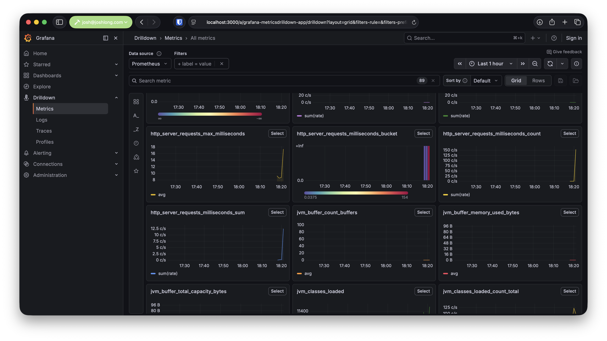

:code: ..

= Spring Boot
// start boot

We've come a long way, but done very, very little.
For all our troubles, we've only got one repository with one method.
Now imagine we were trying to build a real application.
We'd need security; we'd need to stand up a web server.
We'd need observability.
We'd need to package the application up for production.

Let's leverage Spring Boot.
It's already on the CLASSPATH.
Spring Boot builds on Spring Framework (and the rest of the Spring ecosystem).
It's just more Spring, taken a step further thanks to the power of something called _autoconfiguration_.
But first, let's refactor.

Here's the updated `Main` class.

[source,java]
----
include::{code}/beans-to-boot/beans-to-boot/src/main/java/com/example/beans_to_boot/boot/Main.java[]
----

. Spring Boot's `@SpringBootApplication` annotation is itself a _meta-annotation_.
It is meta-annotated with `@Configuration`, which means this `Main` class is also a `@Configuration` class.
It's meta-annotated with `@ComponentScan`, so we don't need to worry about that either.
. because it's a `@Configuration` class, we can use `@Import` on it, just like before.
. through most of the code we've looked at, we've created a Spring `ApplicationContext`.
Here, we're doing the same thing.
The return value of `SpringApplication.run` is an `ApplicationContext`.
But we don't need it, because we don't need to explicitly look up the `DogRepository` to pass to our `test` method.
Instead...
. ...we can define a bean of type `ApplicationRunner`. `ApplicationRunner` beans are given a chance to run as close as possible to the moment when the application is fully initialized and right before it's put into service.
So, here, rather than squatting on the `main` method as we did in every earlier example, we simply register this bean.
We can register as many as we want, for whatever purpose, and know that this logic will run as the service initializes.

== Spring Data JDBC

We're using Spring Boot now.
We've got an object mapper (not quite a _full_ ORM, but close enough) framework on the CLASSPATH.
Spring Data JDBC is capable, and it's already been configured.
Let's rework our repository to leverage it, rather than hand-rolling SQL ourselves.

[source,java]
----
include::{code}/beans-to-boot/beans-to-boot/src/main/java/com/example/beans_to_boot/boot/DogRepository.java[]
----

I know, you're thinking: "Didn't we get rid of the interface ages ago?" But fear not!
The interface is back, but this is _way_ better: we got rid of the implementation!
This interface, which extends Spring Data's `ListCrudRepository`, already has a method called `findAll`.
It also has methods to `save`, `delete`, `findById`, etc.
Spring will create a proxy implementation of this interface at startup time and provide implementations for all those methods by default.
You can even define custom finder methods.
In this example, I've got a finder method called `findByName` that, when invoked, will execute a SQL query of the shape `select * from dog where name = ?`.
It does this by convention.
You can, of course, annotate the method in the interface with `@Query`, and Spring will use your query instead. _Much better!_

== Conventions over Configuration

Spring Boot has a ton of convenient conventions.
For example, it'll create a _real_ `DataSource` backed by the HikariCP connection pool, with properties loaded by convention from the Spring `Environment`.
Spring Boot will, by convention, load any `application.properties` or `application.yml` it finds in `src/main/resources`.
So we no longer need our `@PropertySource` annotation.

== AutoConfiguration

We imported the `DogBeanRegistrar`, so we might as well look at it.

[source,java]
----
include::{code}/beans-to-boot/beans-to-boot/src/main/java/com/example/beans_to_boot/boot/Main.java[]
----

What happened?
Where are all our beans?!
They're gone.
(Almost) all gone.
Spring Boot provides those beans for us, thanks to its marvelous _autoconfiguration_.
So all that remains are our beans.

When Spring Boot starts up, it scans the CLASSPATH for any `.jar` containing a file called `META-INF/spring/org.springframework.boot.autoconfigure.AutoConfiguration.imports`.
That file, in turn, contains a newline-delimited list of Java configuration classes' fully qualified names.
Functionally, these classes are the same as the other Java configuration classes we've seen so far, with some small refinements.
First, keep in mind that Spring Boot will _try_ to load every single one of these configuration classes on startup.
Sometimes the beans in these configuration classes are not important or useful in a particular situation.
It would be grossly inefficient if Spring Boot registered beans that we didn't need.
So, autoconfiguration classes and the `@Bean` methods within are guarded with `@Conditional` annotations.
These annotations point to implementations of the `Condition` type.
These `Condition` instances test something about the application or its environment, and if the test comes back positive, the beans are contributed to the `BeanFactory`.
If not, they are not contributed.

There are many such conditions.
Conditions to test for the presence or specific value of a property in the `Environment`.
Conditions to see whether you and I, the users, have or have not already defined beans of a particular type.
Conditions to see whether certain classes are present in the CLASSPATH.
These conditions let Spring Boot avoid defining beans that aren't needed, and degrade gracefully.
If we'd kept our `DriverManagerDataSource` from earlier, Spring Boot would've backed off on contributing its `DataSource`, because it would infer that we want to exert control here.
In this way, we get the best of both worlds: Spring Boot has sensible defaults that drop away whenever we want to override something.

We can (and should) create our own autoconfiguration if we want to leverage the same convention-over-configuration experience that Spring Boot promotes.

Create an autoconfiguration class of your own.
Be sure to put the code in a package that is _not_ scanned by Spring's component scanning mechanism.
In my application, my root package is `com.example.beans_to_boot`, so Spring will discover all classes in that package or deeper.
So, I'll put the autoconfiguration in a separate, adjacent, package called `com.example.autoconfigure`, not because it's required but because it confirms that we've wired up the autoconfiguration correctly and that this configuration class will be loaded and evaluated regardless of the fact that it's not discovered by the component scanning machinery.

[source,java]
----
include::{code}/beans-to-boot/beans-to-boot/src/main/java/com/example/beans_to_boot/autoconfigure/SillyAutoConfigurationExample.java[]
----

. `@AutoConfiguration` is yet another meta-annotation.
You could use `@Configuration` here if you wanted.
. `@ConditionalOnRandomness` is a conditional annotation that we'll write ourselves in just a moment.
. `@ConditionalOnProperty` is a Spring Boot conditional annotation that will evaluate to true if the property called `my.config` exists in the `Environment`.
We further stipulate that the value will be matched if it's not specified.
If it is specified, and only if the value is `bar`, then this Java configuration bean will be registered.
If this test evaluates to true, you'll see the output of our `ApplicationRunner` when the application starts up.
If not, nothing will happen.

Let's look at the implementation of our (admittedly very contrived) condition.

[source,java]
----
include::{code}/beans-to-boot/beans-to-boot/src/main/java/com/example/beans_to_boot/autoconfigure/ConditionalOnRandomness.java[]
----

. this annotation is a meta-annotation which we've annotated with Spring Framework's `@Conditional` annotation.
We pointed it to an implementation of `Condition` that we've written called...
. `RandomnessCondition`, which evaluates to true whenever the result of `Math.random()` is greater than `0.5`.

Now, create a text file in `src/main/resources/META-INF/spring/` called `org.springframework.boot.autoconfigure.AutoConfiguration.imports` in your project.

[source,imports]
----
include::{code}/beans-to-boot/beans-to-boot/src/main/resources/META-INF/spring/org.springframework.boot.autoconfigure.AutoConfiguration.imports[]
----

Here, we've got just the one class.
This is a bit of a toy, but if you restart the program a few times, you'll see your `ApplicationRunner` run (or not run) in seemingly random alternation.

We could have put this autoconfiguration class and the text file in a separate `.jar`, added that to the CLASSPATH of any Spring Boot application, and Spring Boot would give your code a chance to run _without_ requiring input from the user at all.
This is how you provide seamless, out-of-the-box, sensible defaults and configurations for your users.

But how do you distribute them?
In a `.jar`, of course.
But here again, Spring Boot's design philosophies pay dividends.
Spring Boot uses something called _starter_ dependencies.
These are dependencies that serve only to aggregate other Maven dependencies and to manage their versions.
When you work with a Spring Boot project, as generated from the Spring Initializr, you should only ever have to change one version - at most, four.
All the other Spring dependencies for the rest of the codebase come from the Spring Boot parent artifact, which ensures that versions line up.
If one dependency uses one version of Log4J, for example, and another uses a different one, Spring Boot will pick one and ensure it works for all the dependencies it supports.

Recall that Spring Boot has conditional annotations, one of which is `@ConditionalOnClass`.
A bean so annotated will only be registered _if_ the class is on the CLASSPATH.
Spring Boot _starters_ _activate_ different conditionals because they bring in different cohorts of dependencies.

== An Amazing Web Server

Spring Boot autoconfiguration does a whole heckuva lot more than register a `DataSource`.
You might notice that when you start the program, it doesn't just exit as soon as the `Dog` entities have been enumerated.
Spring Boot started a web server.
Why?
Because we asked it to by adding `Spring Web` to the project _way_ back at the very beginning of this chapter.
So we now have a full web framework and web server in play.

Here, I even wrote a trivial Spring MVC controller that loads all the results from the repository.

[source,java]
----
include::{code}/beans-to-boot/beans-to-boot/src/main/java/com/example/beans_to_boot/boot/DogController.java[]
----

Run the program and then hit `http://localhost:8080/dogs` in your browser to see that it's working.

By the way, when you ran the program, did you notice the pretty colored log output?
And the _amazing_ ASCII art banner?

TIP: If you put a custom banner in `src/main/resources/banner.txt`, Spring Boot will use it instead of the default built-in ASCII art.

Remember when we first introduced `application.properties`?
I didn't speak to some of the configuration values in the property file.
Only those concerned with the `DataSource`.
Let's revisit some of those.

[source,properties]
----
include::{code}/beans-to-boot/beans-to-boot/src/main/resources/application.properties[]
----

. the original database credentials... moving on.
. this property enables virtual threads, a game-changing feature in Java 21 or later.
This will dramatically improve the scalability of blocking I/O.
. this property tells Spring Boot to run `src/main/resources/schema.sql` and `src/main/resources/data.sql` on startup.
Super convenient to ensure the system is correctly configured.

== Observable Services

Spring Boot is production-ready and worthy out of the box.
When you configured the application back on the Spring Initializr, you added the `Actuator` and `OpenTelemetry` dependencies.
The Actuator dependency brings in a slew of endpoints, usually mounted under `/actuator/*`.
There are many endpoints, but most of them are not visible unless you _expose_ them with another property added to `application.properties`.

If you want to see all the Actuator endpoints and the full health endpoint, you might use the following configuration properties.

[source,text]
----
management.endpoints.web.exposure.include=*
management.endpoint.health.show-details=always
----

Now you can visit `/actuator/metrics`, `/actuator/health`, `/actuator/beans`, `/actuator/configprops`, etc.
Visit just `/actuator` to see all the sub-endpoints.

We've also got Grafana running in the background.
As you work through the code in Spring Boot, you might notice that, first of all, you're seeing a good deal more application events.
Second, if you visit http://localhost:3000 and then navigate to `Drilldown` -> `Metrics`, you can see the same metrics you saw under `/actuator/metrics`, but now graphed over time.
Neat!

== GraalVM Native Images

This application runs really quickly and scalably, but could it be faster and use less RAM?
Sure!
One way you might help with that is to embrace GraalVM native images. https://graalvm.org[GraalVM] is an OpenJDK distribution that carries with it some amazing extras.
You'll need to have it installed on your machine.

I'm interested in the `native-image` compiler tool that comes with GraalVM.
It takes a Java program's `.class` files and turns them into native, operating-system- and architecture-specific machine code.
The kind you'd get from using C, Go, or Rust.
The result is a _markedly_ smaller memory footprint and a _markedly_ faster startup time, at the dubious expense of portability.
The resulting binaries only run on the platform for which they were compiled.
If you compile the binary in a Linux CI environment, it'll be fine in a Linux production environment, so it's not as big a deal-breaker as it might sound.

WARNING: Keep in mind that GraalVM native images are _not_ standard Java and in fact run counter in some ways to Java's write-once, run-anywhere mantra and promise of portability.

GraalVM was the first scenario where Spring Boot could leverage ahead-of-time code generation to transform the program into a form that would execute more efficiently at runtime.
One of the AOT transformations that's just been made possible in Spring Boot 4 and Spring Framework 7 is compile-time, ahead-of-time code generation for Spring Data repositories like our Spring Data JDBC repository.
For it to work, however, the AOT engine will need to know which SQL query dialect is being used _at compilation time_.

Add the following bean to help it along.

[source,java]
----
include::{code}/beans-to-boot/beans-to-boot/src/main/java/com/example/beans_to_boot/boot/DataAotConfiguration.java[]
----

You can take advantage of native-image technology thusly:

[source,shell]
----
./mvnw -DskipTests -Pnative native:compile
----

Then, stand back.
It might take a while.
Maybe even minutes.
On my machine, for this application, it takes about 30 seconds to do the full compile.
Your mileage may vary.

Try it.
Go to the `target` folder and run `target/beans-to-boot` or whatever your Maven artifact name was.

GraalVM can have _amazing_ results, but it does require some compromises about which you need to be aware.
The way GraalVM works is by starting from your `main` method entry point into the application, scanning every class that you use, and every class that those classes use, and every class that those classes use, and so forth, and onward until it's built up a giant graph of which classes your program will use.
It retains those and throws every other class away before it compiles your program.
It also throws away reflective metadata (you know, the types and instances that you get back when you try to do something like `Customer.class.getMethods()`).
It also throws away the metadata for JNI references.
And `Serialization`.
Also, all the stuff that aren't `.class` files, but that ship in the `.jar` files for your application - things like `.properties` files, images, etc.?
It throws all that away, too.
Basically, all the stuff that the JVM normally would create and/or load on every startup, but that your program may never need: it throws it all away.
The result is a _lightning_ fast native image which uses a tiny fraction of the usual RAM.

But it's not perfect.
The analysis that results in this much smaller set of classes happens during compilation.
Java's a Turing-complete language.
It's impossible to completely understand at compile time what will happen at runtime.
So the GraalVM compiler might throw things out that you might actually end up needing during runtime.
So you'll need to tell it what to keep.
What _not_ to throw out.
Normally, in a GraalVM application, you do this with `.json` configuration files that live in `.jar` files under `/META-INF/native-image/$\{groupId}/$\{artifactId}/*.json`.

The trouble is that these configuration files are fiddly.
If you refactor a type in your Java code, your IDE might forget to update the entry in the `.json` configuration file.
So, you'll need to update it yourself.
It gets tedious.

Spring Framework 6 and Spring Boot 3 introduced an Ahead-of-Time (AOT) component model that gets evaluated _during compilation_.
Remember when we talked about the Spring `BeanFactory` and said that it handles _ingest_ (the loading of bean configuration from various sources like component scanning, Java configuration, etc.), then turns everything into metamodel objects of the class `BeanDefinition`?
Those `BeanDefinition` objects give any would-be examiner enough information about the objects in the application, including their classes.

Spring's AOT component model builds your application, to that point, giving you access to the `BeanDefinition` objects, and allowing you to programmatically register _hints_, which get translated into the aforementioned `.json` files.

We won't belabor the point, but there are different ways to register these AOT hints, depending on the level of power you need.

For most applications, users should probably get comfortable with `RuntimeHintsRegistrar`.

Let's suppose we wanted to read in a text file (`message`) and write out its contents to the command line when the program starts up.
You could easily construct a `Resource` object and then read its contents in the JVM.
But that text file won't exist in a GraalVM native image, because it'll have been thrown out.
We need to tell GraalVM not to.

Here's the text file.

[source,text]
----
include::{code}/beans-to-boot/beans-to-boot/src/main/resources/message[]
----

Now we need to register some code to contribute the AOT hints.

[source,java]
----
include::{code}/beans-to-boot/beans-to-boot/src/main/java/com/example/beans_to_boot/boot/AotConfiguration.java[]
----

. The `AotConfiguration` class is a stock-standard Java configuration class.
The `@ImportRuntimeHints` annotation loads the AOT `RuntimeHintsRegistrar` class.
This class will be invoked during compilation.
. Spring's `Resource` abstraction is a nice way to represent anything that could be read (that is, it produces `byte`) or written to.
There are many implementations.
Here we're using the one to represent resources on the CLASSPATH.
. the `RuntimeHints` object offers convenient DSL methods to register resources for loading, types for reflection, or serialization, etc.
. By the time this `ApplicationRunner` executes at runtime, the `message` file _will_ be in the memory of the native image and everything will continue to work, all because of the work we did at compile time to make it so.

Conceptually, that's all there is to it!
There are other callback classes besides `RuntimeHintsRegistrar`, but that's a topic for discussion some other day.
What's important to know is that you'll almost never need to worry about registering these AOT hints.
Spring Boot will do it.
Or there'll be configuration in the libraries that you consume.
But not _always_.
In which case, you'll have to do the work yourself.
But at least you now know how.

== Project Leyden

GraalVM native images are my favorite approach for optimization, but they do come with their own caveats.
They don't always work without sometimes considerable finessing, and I won't get into all that here, but there is a whole Spring Ahead-of-Time (AOT) component model that allows you to add supplementary configuration to your Spring Boot applications so that they behave well in a GraalVM native-image context.

If you want a standard way to improve the startup time (and not much else) of your application, you can also use Project Leyden, part of the core Java SDK.
It works reliably on _every_ program, with no compromises, but the results aren't quite as impressive, either.

The thrust of it is that you run the program in a special mode: the JVM dumps out information about which things are used into a file, and that file can then be fed into the `java` CLI on a subsequent run so it'll start up a lot faster.
On my machine, this application is almost 50% faster on startup as a result of using Project Leyden.
Here's an example of doing this training run and then getting great results.

[source,shell]
----
include::{code}/beans-to-boot/beans-to-boot/leyden.sh[]
----

. clean up and staging
. use Spring's AOT mode and do a package
. move the resulting packaged `.jar` to a well-known name, `application.jar`
. run the program using Spring Boot's `.jar` tools to extract the normally nested Spring Boot `.jar` into a folder called `autoconfigure`.
. run the Java program up until the application context's been refreshed, and dump the analysis out to `app.aot`.
. cleanup
. finally, run the program but use the `app.aot` index to dramatically speed up the application.

== The Spring Boot Buildpack integration

For most scheduling solutions, you'll need a container containing your application.
This doesn't mean that you'll need a `Dockerfile`, however.
Quite the contrary.
You're better off automatically building the container rather than manually defining it.
In the world of mystery-meat cloud containers, _less is more_.

Spring Boot's Maven and Gradle plugins can do the work for you by deferring to the https://buildpacks.io[Buildpacks project].
Buildpacks provide recipes for taking application artifacts and packaging them up as containers.
These recipes represent the collective wisdom of the Spring and Java communities that maintain them.
There are also buildpacks for scores of other languages and ecosystems, including COBOL!

Here's how you can use it for your own application.
If you want to build a container for a standard JVM-based application, do the following.

[source,text]
----
./mvnw -DskipTests spring-boot:build-image
----

If you want to build a container for a GraalVM native image, do the following:

[source,text]
----
./mvnw -DskipTests -Pnative spring-boot:build-image
----

Let this run for a bit, and it'll give you the name of the container that's just been created.
You can run it or `docker push` it to whatever container registry you want.
From there, you're off to production!

== Testing

Spring makes it easy to both do the right thing and to focus on doing the right thing.
But how do you know if you've actually done the right?
How do you know if your changes resulted in outcomes you desired when you started writing the code in the first place?
Testing, of course.

In this book, I'll sometimes use tests as ways to demonstrate features.
Other times, I'll just give you code you can run and watch work.
So, let's quickly take a look at the testing story for Spring and Spring Boot.

In a plain JUnit test, you could, of course, quite trivially stand-up Spring Boot and your whole application, obtain references to the beans, etc.
This works, but it's sort of all-or-nothing.
The real art comes in skillfully carving out that which is under test from that which isn't.
That which is variable from the invariant.
And Spring has amazing support here.

Spring has great integration with JUnit, which is the industry standard.
Spring also supports Spock for the Groovy community and TestNG.
But JUnit's the main thing.
Use that, and things will be alright.
One of the core Spring Framework engineers, Sam Brannen, is also a major contributor to JUnit the project, too.
It's no coincidence then that Spring and JUnit have enjoyed a nice symbiotic relationship for decades.

=== The Core Spring TestContext Framework

The Spring TestContext Framework in Spring is a test-framework agnostic framework that provides lifecycle management, dependency injection, support classes, annotations, and more for working with Spring components in a test class.
It works with JUnit Jupiter (which shipped starting in JUnit 5), JUnit 4, and TestNG.
By default, when you configure a Spring Boot project, it configures a JUnit 5-based testing stack.
You can switch to the others, but.. why would you?

In this book, we'll use JUnit 5 when we work with tests.
The core Spring Framework support is massive.
Broadly speaking, there are at least two interesting layers of support: unit-testing, and pseudo integration testing.

=== Unit Testing

I assume you understand the gist of unit testing.
Spring even provides some _mock_ implementations of key Spring Framework types like `Environment` (`org.springframework.mock.env.MockEnvironment`, and the related `org.springframework.mock.env.MockPropertySource`), a bevy of mock-ready Servlet types (see `org.springframework.mock.web`).
These mock objects are for use with Spring’s Web MVC framework and are generally more convenient to use than dynamic mock objects with mocking frameworks like EasyMock.
There is even a slew of _utility_ classes designed to construct interesting objects or answer interesting questions in the context of a test: `AopTestUtils`, `TestSocketUtils`, `ReflectionTestUtils`, `JdbcTestUtils`, etc.
I won't dive too much into this stuff because it's of little import: for our application, we're probably going to do very little unit testing.
Instead, we're going to be working with (secure) applications which will need to have several layers of concerns setup and working to do anything interesting.
We're therefore far more interested in integration-testing.

=== Integration Testing

The support for integration testing in Spring is simple: I want to stand up a Spring `ApplicationContext` and inject the beans I've configured to ensure that they, and they alone, work as expected in the ensemble in which they're configured.
This isn't plain unit-testing, nor is it full-bore integration testing.
It's something in between.

Here's the simplest possible test using only the facilities in Spring Framework.

[source,java]
----
include::{code}/beans-to-boot/beans-to-boot/src/test/java/com/example/beans_to_boot/springframework/SpringTest.java[]
----

. this annotation comes from JUnit and allows customization of the default JUnit lifecycle and instances
. this annotation tells the JUnit Spring support to load a Java configuration class and make available the beans therein.
. and here, inside our test class (though this isn't required, it is convenient and portable), is a Java configuration class with but one bean `Announcer`.

The code for `Announcer` looks like this:

[source,java]
----
include::{code}/beans-to-boot/beans-to-boot/src/test/java/com/example/beans_to_boot/boot/Announcer.java[]
----

It implements `InitializingBean`, which is a Spring lifecycle callback.
In a unit-test, we'd have to call that method ourselves to ensure proper setup.
Similarly, we can trust that the dependency on `Environment` has been satisfied by the time we start poking and prodding at the `Announcer` bean.

At this point there's a good deal more we could do.
We could _delve_ (yes, I know that's a telltale identifier of AI-written prose, but I didn't use AI to write it!) more deeply into the web framework support.
Or the database support and the transaction support.
Tons.

In the example above, injected a _real_ `Environment`.

=== Isolated Configuration

There's a tension we face when doing integration tests. we want things to execute in an environment as close to production as possible - otherwise why bother with integration testing at all? - but we also need to avoid complicating test setup with unnecessary dependencies.
These extra dependencies add no clarity to our determination that some bit of code works or not while simultaneously creating undue burden on the people writing and maintaining the test.
Mercifully, we're using a dependency injection framework.
A framework follows the open-closed principle: it's open for extension, closed for modification.
Put another way: you can change the way Spring behaves without recompiling or changing Spring's code.
This works because you can swap out, conceptually, one bean for another at any time.

Spring already knows how to wire up your entire production application.
Because of this, its testing support isn't about adding more configuration - it’s about removing or carving that configuration up.
You don't need to waste time teaching a testing framework how to mimic your production environment; Spring already has the blueprint.
Instead, your job is to tell Spring how to run less of the application, swapping out or isolating the specific pieces you want to test from the ones you don't.

In this section, we'll look at ways to make this work trivial.

We'll demonstrate these concepts using a simple class, called `StoreService`, which is meant to be a service for, you know, a merchant.
A merchant's store.
It's store-front.

Here's the `StoreService`.
It depends on a bean of type  `java.time.Clock` to do its work.

[source,java]
----
include::{code}/beans-to-boot/beans-to-boot/src/test/java/com/example/beans_to_boot/springframework/StoreService.java[]
----

The `Clock` is configured in `StoreConfiguration`.

[source,java]
----
include::{code}/beans-to-boot/beans-to-boot/src/test/java/com/example/beans_to_boot/springframework/StoreConfiguration.java[]
----

Now suppose I want to test that my logic works correctly.
I can't run this using the production implementation of the `Clock` because, of course, that'll change as time goes by.
I need to pin it down so that it's invariant relative to my test code.

==== TestBean

The first approach is a Spring Framework homegrown approach that might be enough in plenty of cases, and is my first go-to solution when I want to swap out a part of the bean graph.
It requires no external dependencies besides Spring.

When you annotate a field with `@TestBean`, you're telling Spring that you'd like a chance to provide a _bean override_ for beans of that particular type.
In this instance, we provide the bean that overrides the existing one using a `static` factory method.

[source,java]
----
include::{code}/beans-to-boot/beans-to-boot/src/test/java/com/example/beans_to_boot/springframework/TestBeanTest.java[]
----

. here we're telling Spring that we will provide an _override_ for the missing bean and, further, that if there is no other bean to be overridden, then this should be treated as an error.
. here's our `static` factory method which resolves the fixed `Clock` instance.
Spring will invoke this.
. finally: the test.

==== Mockito Beans

In the last example we provided our own instance of `Clock` to override the configured one.
The instance we configured returned pre-programmed results on certain calls.
For a more complex class with more methods, this would involve surgical overrides and finagling state in the parent class.

It could get ugly really quickly.
An alternative is to use Mockito, a mocking library that allows us to define objects that _look_ like our object, but whose responses (and behavior) we can provide to suit the purposes of our tests.

With a _mock_, it's up to us to provide implementations of all the methods we intend to invoke in the course of our test.
No methods of the original class will be called.
If you remember our section on creating proxies, then this sort of thing should be familiar.

We'll use `@MockitoBean` to instruct Spring to create a Mockito proxy for us for a given bean of a given type.
Then, before our tests run, we'll need to program the mock.

[source,java]
----
include::{code}/beans-to-boot/beans-to-boot/src/test/java/com/example/beans_to_boot/springframework/MockitoBeanTest.java[]
----

. instead of us providing a factory method, we'll tell Spring to wire up a `Mock` and replace the bean in teh context with that Mock.
. then we'll use Wiremock's API to instruct the `Clock` on what to do.
. and finally, we'll kick the whole chain of operations off.
If we've done our work correctly, `isOpen` will result in a call to the methods whose responses we just provided.
And the results will work no matter the date.

==== Mockito Spy Beans

A _mock_ is an object whose behavior you can provide.
A _spy_ is a wrapper around a real object.
Methods call the real implementation unless you stub them.

[source,java]
----
include::{code}/beans-to-boot/beans-to-boot/src/test/java/com/example/beans_to_boot/springframework/MockitoSpyBeanTest.java[]
----

. the real `isOpen()` actually executes against the real `Clock`
. ...but it's a spy, so the invocation is still recorded
. we'll override just this call
. and then run the test as usual

A good test tests only that which is under test and isolates all the other invariants.
These three annotations - `@TestBean`, `@MockitoBean`, and `@MockitoSpyBean` - make this trivial for common dependencies.
Sometimes, however, you will need to isolate entire subsystems, like the web tier itself.

=== Testing services with `MockMvc`

`MockMvc` is Spring's tool for testing your web layer (controllers) without actually starting a real server or opening a real network socket.
Here's the core idea.
Normally when you test a Spring MVC controller end-to-end, you'd have to boot up Tomcat, bind to a port, and fire real HTTP requests at it (that's what `TestRestTemplate` or `WebTestClient` against a live port do).
That works, but it's slow and it's more of an integration test.
MockMvc instead spins up the Spring MVC machinery - the `DispatcherServlet`, your handler mappings, argument resolvers, message converters, validation, exception handlers, filters — in memory, and lets you send mock requests straight into that dispatcher.
No socket, no port, no real HTTP.
So what it actually does is give you a fluent way to say "pretend an HTTP request came in, and let me assert on what the controller layer did with it.
Here's an example.

First, we'll introduce a trivial Spring MVC controller.
We won't get too much into this right now, but you've seen a similar controller already.

[source,java]
----
include::{code}/beans-to-boot/beans-to-boot/src/test/java/com/example/beans_to_boot/springframework/SimpleController.java[]
----

Now let's write a simple test that exercises this controller.

[source,java]
----
include::{code}/beans-to-boot/beans-to-boot/src/test/java/com/example/beans_to_boot/springframework/SimpleControllerTest.java[]
----

. first we tell Spring's `MockMvc` machinery to set up the web tier around this particular controller
. we use the configured `MockMvc` and use it to make requests against the HTTP API and make assertions about the request and response.

=== Testing clients with `RestTestClient`

`MockMvc` lets you test the behavior of the service, while mocking out the client. `RestTestClient` does the inverse, letting you test the behavior of the client, while mocking out the server.
Let's try that out, testing the client behavior itself.

[source,java]
----
include::{code}/beans-to-boot/beans-to-boot/src/test/java/com/example/beans_to_boot/springframework/SimpleClientTest.java[]
----

Here, we're using a fake client to exercise the network and protocol interface for the service and to make assertions about the results.

// todo
// springboottest
// slices
=== Testing in Spring Boot

So far we've looked at isolated pieces in Spring Framework and seen how they layer one on top of the other.
But a typical, secure application has a good many more moving parts, parts that are usually supplied by Spring Boot autoconfiguration.
Spring Framework doesn't know about Spring Boot autoconfiguration.
And we'd have to recreate all of it to sufficiently test things as to reproduce them in production.
Instead, we'll use Spring Boot's testing support, which builds on the support introduced in the Spring Framework, to do this.

Everything you've learned so far still applies, there's jsut _more_ to the story.
Let's start with a jack-of-all trades annotation, `@SpringBootTest`, which works every time, but might be more than you need in some cases.
Add `@SpringBootTest` to a test class and it'll launch the production configuration and environment and then your tests will run with access to all the requisite beans.
You can continue using `@TestBean` and `@MockitoBean` and `@MockitoSpyBean`, of course.
Let's look at an example.

[source,java]
----
include::{code}/beans-to-boot/beans-to-boot/src/test/java/com/example/beans_to_boot/boot/BootifulTest.java[]
----

. we have access to everything Spring Boot will have autoconfigured, including the `DogRepository`.

Good news! we can inject the _live_ `DogRepository` and poke at it, just as if you were in your production code.
Bad news: it's _live_!
Don't forget to start your Docker image before running this test!

There are, of course, ways around this.
If you visit the Spring Initializr and choose `Docker Compose` support and then choose, say PostgreSQL, you'll get a Docker Compose `compose.yml` file that looks like this.

[source,yaml]
----
services:
  postgres:
    image: 'postgres:latest'
    environment:
      - 'POSTGRES_DB=mydatabase'
      - 'POSTGRES_PASSWORD=secret'
      - 'POSTGRES_USER=myuser'
    ports:
      - '5432'
----

this is fantastic during development because you can live that `git clone`-and-run lifestyle.
Spring Boot will detect it and automatically run it _and_ it'll automatically connect to it.
No need to specify the connection details, e.g.: `spring.datasource.url`, `spring.datasource.username`, etc.
Indeed, the `compose.yml` we've used for this chapter and the last one?
I sourced it from the Spring Initializr and took the liberty of exposing the ports.
The default generated on the Spring Initializr does not do this, because it doesn't need to.

But what about during development?
Here you might want to use Testcontainers.
Testcontainers are an amazing Java library for running Docker images from Java code.
There's a core `Container` class which you can instantiate to launch any arbitrary Docker image.
Some of these Docker images have supported configuration properties, environment variables, required mounts, etc.
So the Testcontainers project has put together a library of specializations that take strongly typed parameters to help you construct a Docker image correctly.
If you choose PostgreSQL and Testcontainers on the Spring Initializr, you'll get two new classes in your `src/test/java` folder:

* a `Test*Application.java` - you can run this class as you develop, usually in tandem with the Spring Boot Devtools, and you'll have your full production object graph _and_  bean(s) for the applicable Testcontainer(s).
You don't need to even define the requisite properties to connect to this new instance.
Spring Boot will derive them for you and connect automatically.
It'll do this by importing the next class..
* ..which is `TestcontainersConfiguration.java`.
This class defines the actual Testcontainers objects.

It this latter class that we'll use to automatically stand up a PostgreSQL database process.
Here's our improved test.

[source,java]
----
include::{code}/beans-to-boot/beans-to-boot/src/test/java/com/example/beans_to_boot/boot/BootifulTestcontainersTest.java[]
----

. this pulls in our Testcontainers configuration

And here's the actual Testcontainers configuration class, defining a bean that we've identified as a `@ServiceConnection`.

[source,java]
----
include::{code}/beans-to-boot/beans-to-boot/src/test/java/com/example/beans_to_boot/boot/TestcontainersConfiguration.java[]
----

. this is a meta-annotation for `@Configuration`.
. a `@ServiceConnection` is a bean that Spring Boot will identify and use to hydrate connection details automatically, obviating the need for us to specify, e.g., `spring.datasource.url`, `spring.datasource.username`, etc.

Shut down all your Docker images and then run this test, and it'll still work, because the service connection will supply the PostgreSQL instance and our SQL initialization logic (`schema.sql` and `data.sql`, defined earlier) will initialize the schema, all before we ever run a single test.

The test is green.

== Next Steps

In this section we explored the awesome force-multiplying potential of Spring Boot and saw how it frees you to focus on that which matters: building the best, most valuable application possible for your customers.

At this point, you're grounded enough in the concepts that you at least know where to start looking when working with new features in a Spring Boot world.
This will serve you well as we move up the abstraction stack in subsequent chapters.
