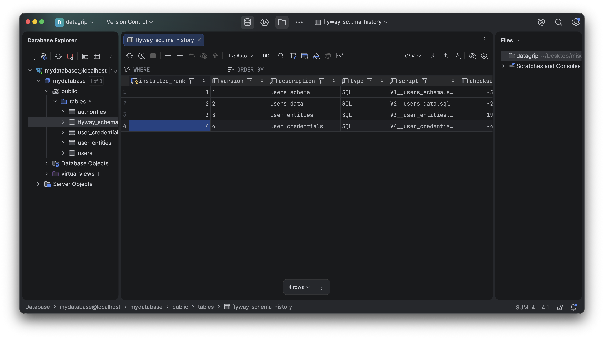

:code: ..

= Conventions

In this book I'll do certain things that are for the purposes of this book and not necessarily the best configuration for code.
There's a fundamental tension in the way books are written and the way code is written that I wrestle with on every attempt.
I've long tried to find ways to write that avoid errors in the reproduced code.
I want all the code printed to be compiled and valid.
It is for this reason that the vast majority of the code reprinted in this book, and especially of the code reprinted in this book that comes from code I've written for this book, is actually in include of some actual source code.
It's _not_ code I copied and pasted into some Microsoft Word document or something, and that has long since diverged from the state of the "actual" code.

== Code

As I work through these examples, I'll be showing lots of code.
You can follow along at home, either by typing things out or simply referencing the https://github.com/secure-all-the-things-book[code here].
It's Apache 2 licensed and yours for the taking.

== Formatting

I wrote some tooling to ensure that every example in the book is using the same version of Spring Boot, assumes the same version of Java (or Kotlin), and is using the same version of any projects that aren't managed by Spring Boot's parent `pom.xml`.

I also wrote some tooling to format the `pom.xml` files exactly the same and to format the Java source code exactly the same, too.
I'm using the https://github.com/spring-io/spring-javaformat[Spring Java Format Maven plugin].
There's also a variant for Gradle.

The Spring Boot team created this plugin to consistently format the code in Spring Boot itself.
This way, it doesn't matter if a contributor to the project is using emacs, vim, IntelliJ IDEA, Visual Studio Code, Eclipse, etc.: their code can be quickly and consistently formatted to match the project's style.
Less quibbling about tabs vs. spaces, and more closed issues.
This is a _good thing_!

If you want to format the source code:

[source,text]
----
./mvnw spring-javaformat:apply
----

Sometimes the formatter, which internally is based on the Eclipse IDE's formatter machinery, might format things in a way that reads poorly on a printed page.
I sometimes force its hand by add empty line comment delimiters (`//`) at the end of a line, which forces the formatter to wrap to the next line.

== Noisy Configuration Classes

Often, you'll see me introduce new beans in new configuration classes when they could've just as easily gone in a previous configuration class.
This is so that I might avoid reprinting the original beans while keeping code working.

== Spring Profiles

Similarly, I might introduce beans that I don't intend for us to land on, but that are interesting to know about.
These beans are useful, but not the intended final result.
In these cases, I'll use a Spring _profile_, which is a marker annotation that makes the bean inert - Spring doesn't "see" it - until you explicitly _activate_ the profile.

[source,java]
----
@Configuration
@Profile("example")
class MyConfig {

 @Bean
 Bar bar(){
   // ...
 }

 @Bean
 @Profile("foo")
 Foo foo(){
   // ...
 }
}
----

Usually, you activate the profile (or profiles) by passing in a comma-delimited command line switch, e.g.:

[source,shell]
----
./mvnw -Dspring.profiles.active=example,foo spring-boot:run
----

In this example, both the profile for the configuration class, `example`, and the profile for the nested bean, `foo`, are active and thus both the configuration class and the specific beans inside of it will be active.
If the profile `example` is active, but not the `foo` profile, then the result would be that _only_ the `bar` bean would be active, since it has no other profile.

As you work through the book, either remove the profile or activate it to ensure the relevant code runs when you run the example.

Generally, however, I try to avoid profiles for "real" code intended for production, as they make it easy to violate the 12-Factor principle of one build for multiple environments.
And, there are some sticky issues with the use of profiles when building Spring AOT-powered applications.
All in all, it's worth avoiding.

== Nullability

Starting from Spring Framework 7 and Spring Boot 4, the entire Spring portfolio adopted the https://jspecify.dev[JSpecify.dev annotations].
These annotations define null restriction on references in the codebase.
They give build tools like Apache Maven and Gradle, IDEs like IntelliJ IDEA, and compilers like Java and Kotlin feedback about when a `null` reference is being passed to a place that it should not be.

Sometimes, in the course of this book, I'll present interfaces or types from Spring that feature these annotations.
Spring Security is a very good example of this.
It's an old project whose origins assumed a world where all authentication attempts would include a password.
Later, new ways to authenticate (and arguably more secure ones) developed and the password field in the original `Authentication` became _nullable_.
That is, the password wasn't required because there might be other things in the request - a token, a certificate, etc. - that did the work of identifying the user and so the password wasn't needed.

Adopting these JSpecify.dev annotations has been helpful for even the Spring team because it helped us to see places where our suppositions around null references didn't universally hold true.
Considering that Spring Security is more than 20 years old, it's not surprising that these occasional inconsistencies sometimes read their ugly head!

Often, in the Spring codebases, you'll see a `package-info.java` class that contains a single package declaration and `@NullMarked`, like this one from `org.springframework.context`:

[source,java]
----
@NullMarked
package org.springframework.context;

import org.jspecify.annotations.NullMarked;
----

`@NullMarked` says that unless shown otherwise, every reference in this package is meant to be non-`null`.
Occasionally, you'll see such exceptions marked with `@Nullable` on specific fields.

== Spring Initializr Project Configuration

In this book we'll look at a _lot_ of code, and I'll always go to the Spring Initializr and tell you how to consturct a project of similar makeup.
I will basically always choose Apache Maven and I will basically always choose the latest and greatest version of Java or the latest and greatest long-term support (LTS) version of Java or Kotlin.
At the time of this book's writing, the latest LTS is Java 25.

I may forget to stipulate the artifact ID.
Use whatever you want there in this case.

If you're using the https://spring.io/tools[Spring Tools] for Visual Studio Code or Eclipse, or if you're using IntelliJ IDEA, you will have wizards inside of the IDE that'll guide you through the same steps as you would go through on the Spring Initializr.
Indeed, those in-IDE wizards are frontends to the same webservice that powers the Spring Initializr, so the results are exactly the same.
Feel free to use those, but for consistency, I'll refer to the Spring Initializr experience.

The Spring Initializr gives you a `.zip` file that you have to unzip.
Inside you'll find a `pom.xml` (or `build.gradle` or `build.gradle.kts` if you go those routes).
I usually then run IntelliJ IDEA: `idea pom.xml` from the command line.

I do this _so often_ that I've even got a little Java script you can use.

[source,java]
----
include::snippets/uao.java[]
----

I've created an alias to that script in my shell called `uao`.

== Docker

I assume the availability of Docker or some sort of container orchestrator on your machines.
Where appropriate, I've provided Docker Compose `compose.yml` files in each of the chapters' code.

If you're using the Docker tooling, you can spin up the container images thusly:

[source,shell]
----
docker compose up
----

That will run the Docker images and block, keeping the shell on that process in the foreground.
If you want to run things and the background them, do:

[source,shell]
----
docker compose up -d
----

== Databases

I'm going to pretty consistently use PostgreSQL in this book.
Is it the best choice?
No.
I mean.. define "best." But it works, and it's widely adopted.
I'm a big fan.
That said, it's got some peculiarities that make otherwise standard SQL files fail to run on it out of the box, which is a bit of a shame.
I'll note those as I go.

I usually use a tool like JetBrains' DataGrip to read data from my various databases, including PostgreSQL.

Here's what I'm (usually) looking at when I talk about consulting the data in a given database table.

. DataGrip, in all of its glory.
It's a very nice database client.
That said, I _really_ miss Microsoft Access' visual query builder from the distant, distant past, and wish they'd build something like that for this.

I appreciate however that most folks won't do that.
They'll probably just the (excellent) PostgreSQL command line interface.
If you're on Homebrew, you can simply run the following to install just the command line client.

[source,shell]
----
brew install libpq
----

With that, it's trivial to connect to the database.
I'm using the default database name, username, and password that you get in the generated Docker Compose files (`compose.yml`) from projects created on the https://start.spring.io[Spring Initializr].
So, here's how you'd connect to such a database using the PostgreSQL CLI:

[source,shell]
----
PGPASSWORD=secret psql -U myuser -h localhost mydatabase
----

== Database Migrations

I am trying to keep things simple, as I introduce them.
Sometimes, I will use Spring's ability to run `data.sql` and a `schema.sql` script at program launch to initialize the database.
In Spring Boot, you configure this with the following property.

[source,properties]
----
spring.sql.init.mode=always
----

There are other options, `never` and `embedded`.
Obviously, if I weren't going to use it, I'd simply not put it on the classpath.
So I _never_ use `never`.
And `embedded` is the default _if_ you have an embedded database like H2 or HSQL or the CLASSPATH.
Wherever possible, I will use Docker (and Docker Compose, specifically) to standup instances of PostgreSQL.
From Spring's perspective, this is a _remote_ database (even if Spring Boot can be made to run `docker compose up -d` or to launch the Docker container using Testcontainers), so we must specify `always`.

Another option I may employ as I iteratively evolve the schema, introducing new concepts as we work, is Flyway, which can be used for versioned database migrations.
It requires a SQL database table, which it will install for itself, and it'll keep track of which schema files have been applied.
It looks by default in `src/main/resources/db/migrations` and runs all the SQL files it finds there in the order in which they're number, `V1_foo.sql`, V2__bar.sql`, `V3__baz.sql`, etc.
