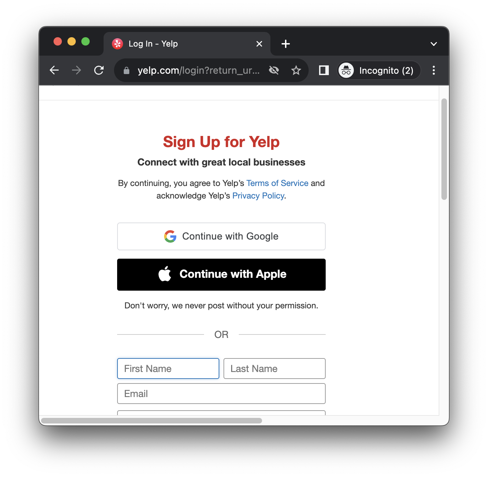
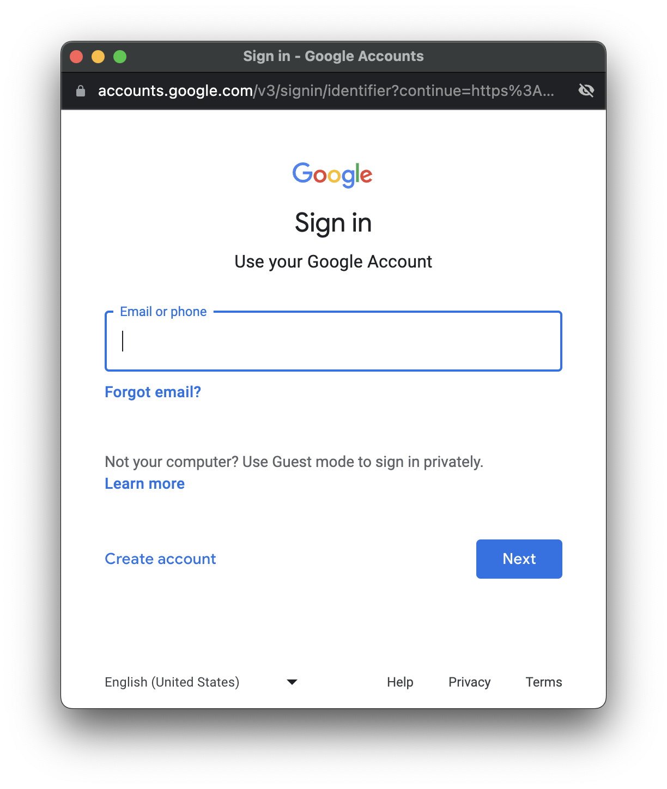
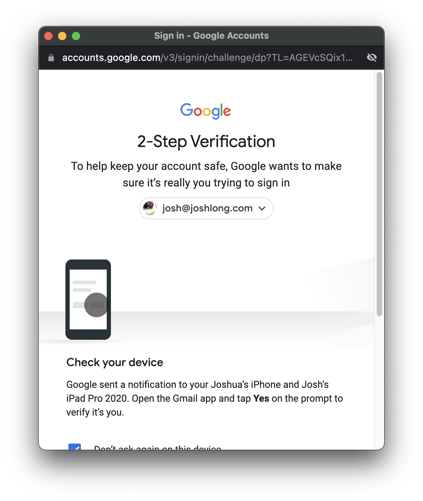
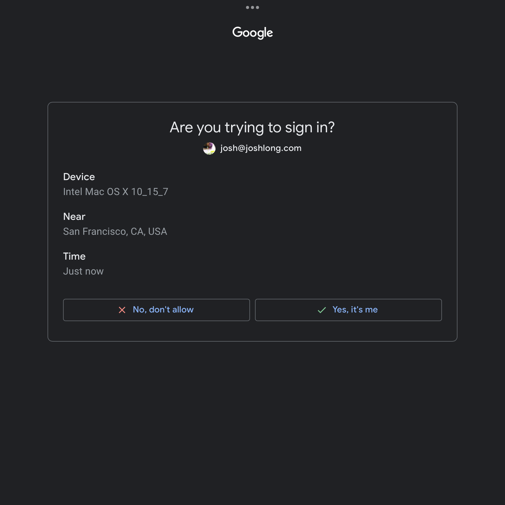
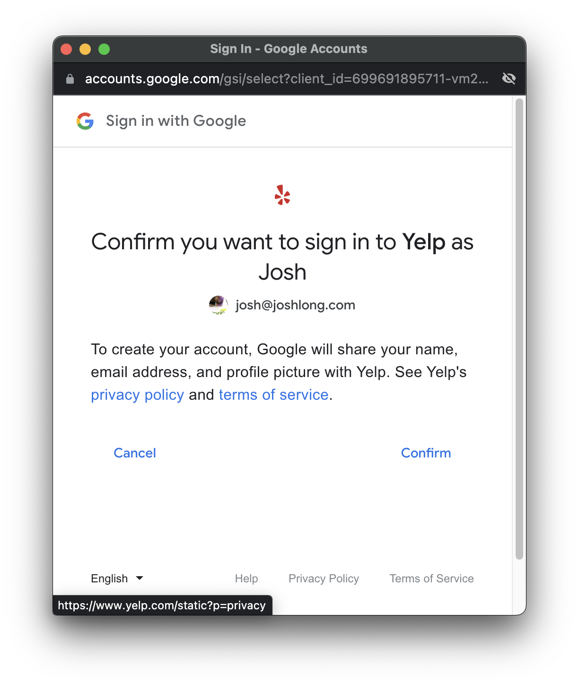
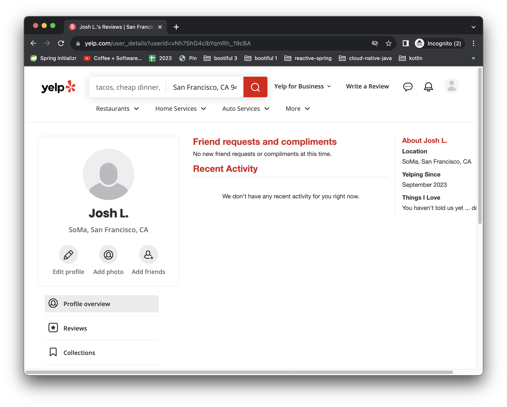

:code: ..

= Implementing the Spring Authorization Server

Go to the https://start.spring.io[Spring Initializr (start.spring.io)], specify a group ID and an artifact ID (I chose `bootiful` : `authorization-server`) and add  `OAuth2 Authorization Server` as a dependency.
I'd add `GraalVM Native Support` for good measure, but you do you.
Open the downloaded project in your IDE.
I'm using IntelliJ IDEA, but again, you do you.
I ran the following command from the root of the newly unzipped archive: `idea build.gradle`.

You've got a new Spring Boot Authorization Server.
We need to specify two things: *users*, and *clients*.

== Users

Users are pretty straight forward, right?
A user is the sum of the username, password, and associated information attached to the system's notion of _identity_.
The beating heart of our system.
The _tenant_ in "multitenant."

There are a lot of ways to get this done.
The easiest might be to just have one user, the _default_ user, which you can describe using Spring Boot's associated properties, like this:

[source,properties]
----
include::{code}/authorization-server/authorization-server/snippets/default-user.properties[]
----

This gets us off the ground, but as soon as you want two or more users, you'll need to specify them a different way.
The easiest is probably to define a bean of type   `InMemoryUserDetailsManager`, like this.

[source,java]
----
include::{code}/authorization-server/authorization-server/snippets/UserDetailsConfiguration.java[]
----

Thus configured we've got two users:

* `josh@joshlong.com` with password `pw` and roles `USER`
* `rwinch@spring.security` with password `p@ssw0rd` and roles `USER` and `ADMIN`

This implementation is fine for development as it's all in-memory.
In a production system, you'll probably want something more durable.
We'll look at those possibilities in a bit.
For now, let's talk about OAuth clients!

=== OAuth Clients

An OAuth client defines how a program or process interacts with an OAuth Authorization Server (like Spring Authorization Server).
Clients correspond more or less to the programs that would like to be allowed to act on behalf of users but need their permission - their _access tokens_ - to do so.

I have tried to conceive of a clear illustration of clients in a vacuum, but it's not easy. so let's examine a real life example: you stumble upon some website, say https://www.yelp.com/[Yelp], a website that lets you contribute and read reviews about locations - restaurants, businesses, tourist spots, etc.
You want to login to see your history.
You _could_ create a new account there, going through the whole signup flow and entering redundant information, but this information could soon become stale.
Worse: you've probably already entered this somewhere else on the internet and done a better job of maintaining it there, too.
Maybe you change house or email address, or whatever, and you've forgotten to go back to the site and change your information.
Yelp know this, so they offer another path forward: `Continue with Google` and `Continue with Apple`.

Click the button and another window on Google or Apple's sites pop up.

You know what to do here: you're in familiar territory.
It's google.com!
You know Google.
And if you've ever set up an account and stayed logged in while navigating the web, Google _almost certainly_ knows you too!
You've got an account here, you maintain that account, and you like that account.
You use it for your daily email, after all.
You've even got that reassuring little padlock icon in the browser's location bar giving you the warm-n-fuzzies about this site's authenticity: it is who it claims to be.
So you enter your information, login, and you do whatever mutli-factor auth things Google wants you to do. You might get a prompt on another device, you might use a passkey, etc. Let's suppose we get the prompt on another device.

This shows up as a prompt on a completely different device, an iPad.

You've approved of the login, so that Google knows it really is you logging in, and now it's got to make sure you realize you're handing over some of the data associated with your identity to this new website, Yelp.com, so it throws up a consent form.

You click `Confirm` and then are finally logged in, with your Google identity, on Yelp.com

At the end of this exchange, Google.com transmitted a _token_ to the application running at Yelp.com.
Armed with this, the application running at Yelp.com can now transmit requests to the Google.com APIs, asking it questions about you, like your email.
It might also be able to read your Google calendar events, location data, etc.
What precisely the application at Yelp.com has access to is a function of the _scopes_ requested by the client.
The application at Yelp.com stores the token and uses it to interact with Google on your behalf.
Occasionally, Google.com will expire the token.
Tokens, like milk, go stale!
No worries: the application at Yelp.com was also given a _refresh_ token it can use to refresh the access token and get a new one.

You're glad you signed up at Yelp.com, but look at the time!
It's noon, the sun's out, and the kid wants to go play mini golf at the place you just found on Yelp.com.
Gotta go!

Time passes, and you return to Yelp.com a week later.
By this point, Yelp.com's expired your HTTP session, and you're logged out.
No problem.
Click the `Continue with Google` button again, and this time you'll just be dumped into Yelp.com, fully authenticated.
Both Google and Yelp remember who you are, and so there's no ceremony this time.
You got fast-path'd into an authenticated HTTP session on Yelp.com.
Thus: OAuth is invaluable both for establishing a new account and for subsequently logging into it.
You may have changed your home address on Google.com in the meantime, and now Yelp.com can see the new address information and offer you updated recommendations, too.
So Yelp.com is kept up to date, and all you had to do was keep Google.com up to date.

From the perspective of Google, Yelp.com is an OAuth client.
All the particulars of how you went through that authentication flow - whether you needed to be redirected to Google.com, whether you should be shown a consent form, and what data Yelp.com was allowed to read from the Google.com API once it had a token stemming from this authentication flow, was governed by how the developers at Yelp.com registered their client with Google.

Clients must stipulate a client ID, and a client secret.
The client ID and client secret are transmitted in the request initiating the authentication flow, signaling to Google that Yelp.com is making this request.
Clients also stipulate what _scopes_ they want.
A scope is OAuth's version of rights, permissions, authorities, or claims.
They're (basically) arbitrary strings that mean something to Google.com's API about what you may and may not access.

There is one scope, `openid`, which is part of the OIDC specification and allows an OAuth client to authenticate users in a standard way.
Specifically, it has two effects:
 * an ID token that contains a JWT that client applications can consume to understand who the user is.
 * it gives the client access to the `UserInfo` endpoint. This endpoint provides additional information about a given user.

This is a sort of special case; Yelp.com may not want to read Google Calendar data, or read your email, or draft a spreadsheet for you in Google Drive.
The  scopes to support those Google-y things would necessarily be unique to Google's APIs.
But signing a user into a site is a common enough thing and one that can be implemented usefully across all sorts of OAuth providers, so there's a specification called OpenID Connect (OIDC), that builds on top of OAuth 2.0, prescribing standard scopes and , importantly, standard APIs by which a client may look up information associated with a user.
Yelp.com might only just need enough information from Google.com to fill out a signup form for us: name, email, etc.
In this way the Yelp.com client could even reuse the same code across other OIDC compliant providers, changing only the client ID and client secret and the issuer URI (the API's root URL).
Neat-o!

So, if you built a backoffice process, you'd register a client for that backoffice process.
If you built a new web application that you intend to support automatic sign-in with OAuth, you'd register a new client for that web application.

The simplest way to register clients in the Spring Authorization Server is to use properties in the `application.properties` or `application.yaml` file, like in this `application.yaml` example:

[source,yaml]
----
include::{code}/authorization-server/authorization-server/snippets/registered-clients.yaml[]
----

<1> you can use the https://docs.spring.io/spring-boot/docs/current/reference/html/cli.html[`spring`] CLI to encode a password for the client secret: `spring encodepassword BLAH`, where `BLAH` is the string you want to encode.
In our case, the client ID is `crm` and the client secret is `crm`.
(Again, I _know_ it's a terrible password.
Don't `@` me!).
NB: For complex strings like this, YAML parsing rules can be problematic, so I tend to wrap these things in quotation marks.
<2> `authorization-grant-types` refers to the use case - web application, mobile, headless backoffice application, etc. - for the authentication flow. https://oauth.net/2/grant-types/[OAuth 2.0 is nothing if not flexible].
<3> we're building a web application so the expectation is that, once you've authenticated yourself with the Spring Authorization Server, it'll redirect you back to the web application with the token in tow.
But where?
You specify that here.
We haven't looked at the application yet, so this is a bit of foreshadowing, but the redirect URI specified here is designed to line up with Spring Security's OAuth client support, which we'll use on the web application.
<4> Here we specify which scopes we'd like to be given.
We've seen `openid` before, and the other two are arbitrary, and just for demonstration.

At this point, we have a valid Spring Authorization Server, and you're ready to start using it!
Run the application in the usual way: `./gradlew bootRun` or `./mvnw spring-boot:run` or just run the main method from your IDE.
Congratulations on your first deployment of the Spring Authorization Server.
We _could_ stop here, satisfied that we have got _something_ to allow us to handle development chores and start building services.
Indeed, if you want to, you can skip ahead and things should work fine.

Eventually, however, you're going to realize you can't leave things as they are - you'll need durable state.
As-is, everything is kept in-memory.
It's obviously a non-starter to have to redeploy the Spring Authorization Server every time you add a new client, user, or otherwise.
People will want self-service forms by which they can register new users, clients, etc.
All existing OAuth tokens would become invalid once you restart the Spring Authorization Server, too!
All state related to any successful OAuth authorizations would be forgotten on every restart.
The situation's not good, and in the next section, we're going to look at introducing persistence, with JDBC, to get around it.

If you want to carry on using property files, then perhaps consider the Spring Cloud Config Server.
It's another piece of Spring Boot-powered middleware that, once stood up, mediates access to configuration files via an HTTP API.
The configuration files live in a version control system, like Git, which the Spring Cloud Config Server monitors.
When the files change, the Spring Cloud Config Server serves up the new configuration data.
Even better, the Spring Cloud Config Server can, via the Spring Cloud Bus abstraction, publish notifications to your microservices (like the Spring Authorization Server) on an event bus like RabbitMQ or Apache Kafka so that you can automatically reload the new configuration.
This works particularly well in tandem with the Spring Cloud's `@RefreshScope`.
In such a configuration, the configuration for everything still lives in a `.properties` or `.yaml` file, as it does now, but the files are centralized and can be changed without reloading the Spring Authorization Server.
Storing files in a version control system gives us niceties like versioning, auditing, rollbacks, etc., for very sensitive configuration data.
And, going a step further, you can even use the Spring Authorization Server to store data encrypted at rest.
For more on these possibilities, check out this https://www.youtube.com/watch?v=aC_siBP8rx8&list=PLgGXSWYM2FpPw8rV0tZoMiJYSCiLhPnOc&index=31[video I did some years ago].
And _all_ of these possibilities are enabled entirely because the Spring Authorization Server is delivered as just another Spring Boot autoconfiguration!
