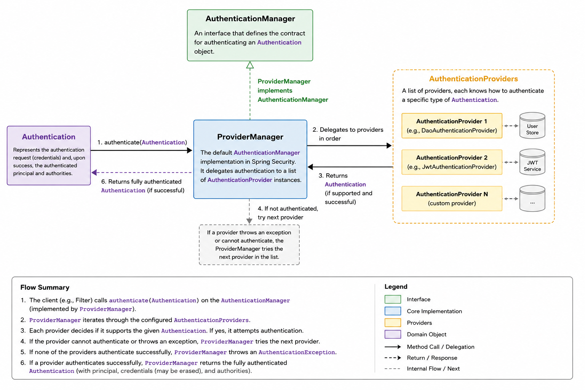
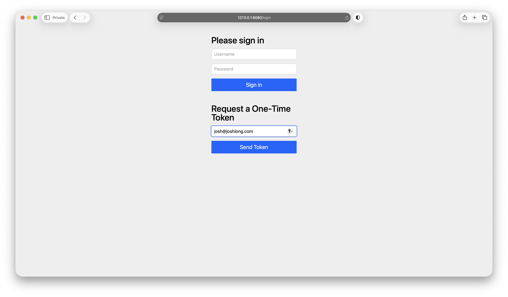
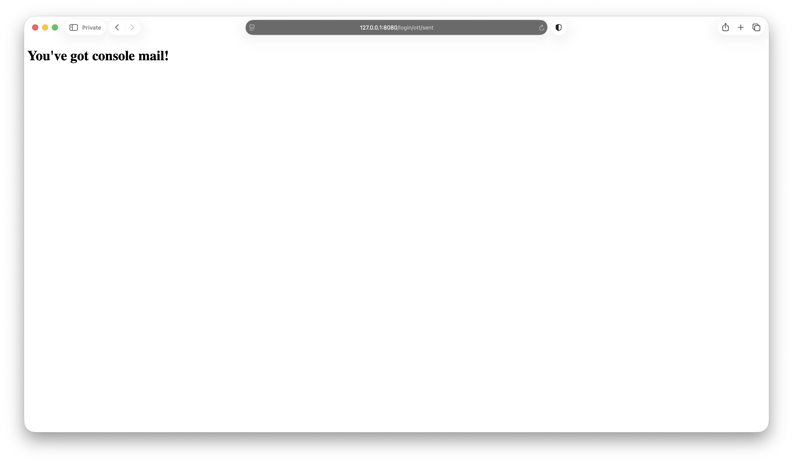
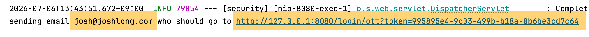
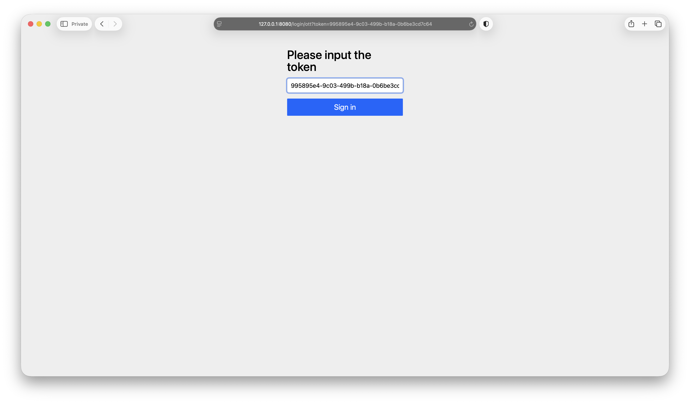
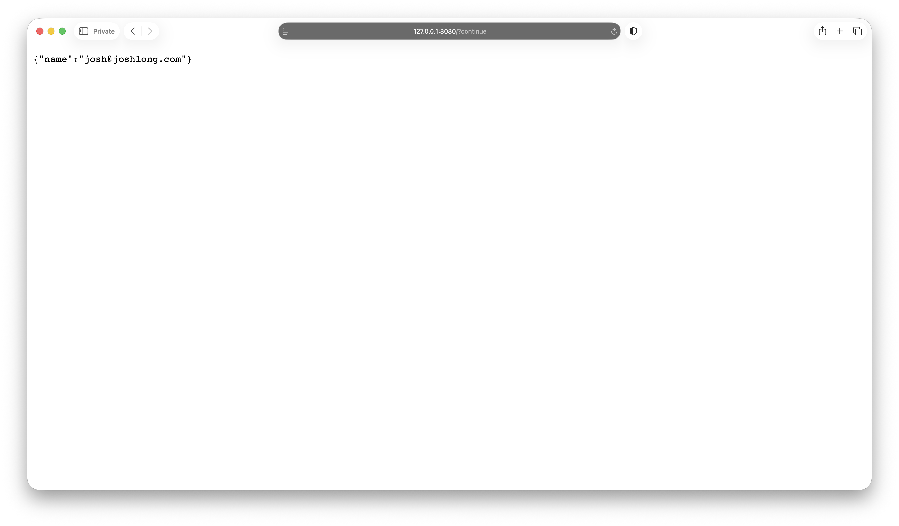
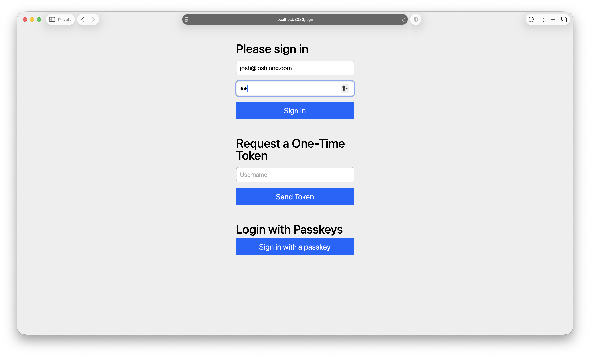
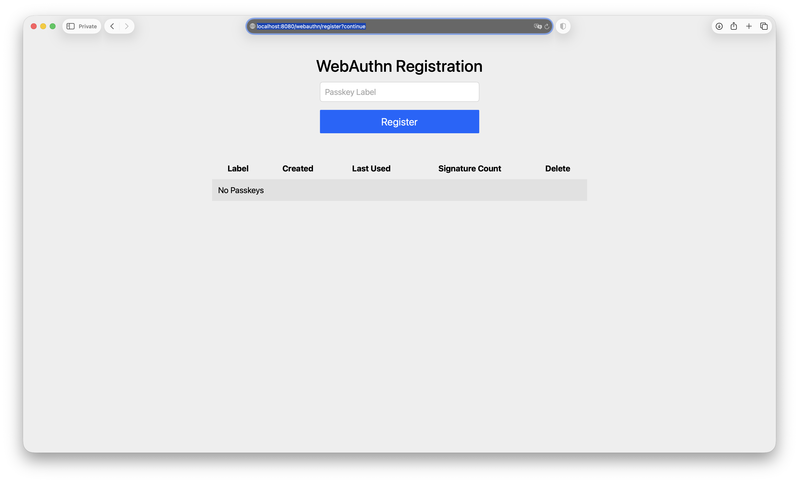
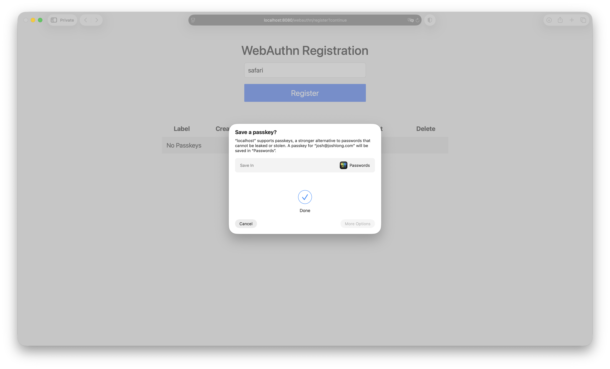

:code: ..

= Spring Security Fundamentals

In this section we'll look at the fundamentals of Spring Security.
After all, we won't get far without those core concepts in place.

== Spring Security, the Project

Spring Security began in late 2003 when Ben Alex created what was originally called Acegi Security (or the Acegi Security System for Spring) after discussions on the early Spring developer mailing lists about the need for a comprehensive security framework.
At the time, the Spring Framework lacked a robust security architecture, leaving developers to build custom, application-specific authentication and authorization solutions.
Acegi was designed from the ground up to leverage Spring’s core principles of dependency injection and aspect-oriented programming, providing a configurable, pluggable security architecture built around a flexible servlet `FilterChain` that allowed developers to bypass rigid container-managed security entirely.
It quickly gained traction by handling both robust authentication and complex authorization directly within the Spring application context.

Ben released Acegi as an open source project under the Apache License in March 2004. The project rapidly attracted a small but enthusiastic community and gained traction within the Java ecosystem.
By 2006, Acegi had matured into a production-ready framework, and in 2007 it was officially adopted into the Spring portfolio as an official Spring subproject.

This era, for me, was where I started to really get excited about Spring.
It's where I decided I wanted to be a part of the story.
I'd used Spring Framework and all of its wonderful little `Template` classes and its web framework and dependency injection framework and all that in my various applications, but 2006 is where I started to appreciate the big-picture potential: in knowing the Spring component model, I had purchase in all the other domains that Spring would take me.
Spring Security meant that I was already halfway towards having secure applications and services.
Spring Batch, also released around this time, let me learn the domain of batch processing in terms of the familiar idioms in Spring.
I was already halfway there!
Spring Integration, also released around this time, let me learn the domain of enterprise application integration, messaging, and event-driven architecture in terms of the familiar idioms of Spring.
I was already halfway there.
To be clear, there were alternatives for these particular use cases, but none of them integrated so deeply with Spring and its guiding philosophies.
I'd have to learn a whole different paradigm, ecosystem, and maybe even language and runtime to get any footing in those alternatives.
Spring opened doors and let me cut to the heart of the matter.

Later that year, Acegi was rebranded as _Spring Security_, with Ben Alex handing the leadership reins over to Luke Taylor to guide the framework into its next major chapter: the release of Spring Security 2.0 in April 2008.

The transition into the Spring portfolio brought even tighter integration with the Spring ecosystem and continued refinement of the framework’s architecture.
Under this new era of stewardship, Spring Security 2.0 introduced namespace-based XML configuration, _dramatically_ reducing the boilerplate that had made earlier Acegi configurations notoriously verbose.
I can't stress this enough.
Spring Framework's main configuration mechanism _used_ to be XML, and in 1.0, the only way to wire up objects was to define instances of every bean required for a given application, no matter how many were required.
There was no mechanism for composition.
No way to say, _I want all *these* beans in *that* namespace, now_.
We'd have to type them out, one by one, and configure them all, one by one.
As you can imagine, in the domain of security, there are _many_ moving parts, and every wayward developer had to understand all of them to get even the simplest application up and running.
You won't have to deal with that in this book, of course.
We've had nearly two decades of Java configuration, and more than two decades since XML namespaces and schemas were introduced.
I just wanted to register that it used to be unwieldy.
I don't know if writing a book is cheaper than therapy, but it's definitely more validating.

The framework evolved well beyond basic authentication and authorization, cementing a flexible architecture centered around servlet filters, authentication providers, method security, and deep integration with the Spring Framework.

As stewardship expanded to a group of maintainers - including Luke Taylor, Rob Winch, and a growing community of contributors - Spring Security continued to modernize alongside both the Java ecosystem and the changing web.
At this point, no single engineer has done more to improve Spring Security than its current lead Rob Winch, about whom you'll no doubt hear more from me in the course of this book.

The 3.x generation introduced features such as _Spring Expression Language_ (SpEL)-based access control, improved LDAP integration, OpenID support, and built-in protection against common web vulnerabilities like Cross-Site Request Forgery (CSRF).
Spring Security 3.2 and 4.x shifted the preferred programming model away from verbose XML toward Java-based, type-safe configuration and fluent APIs.

The framework’s evolution accelerated as application architectures shifted toward cloud-native systems and distributed services.
Spring Security 5 introduced first-class support for OAuth 2.0, OpenID Connect, reactive applications built with Spring WebFlux, and a modernized password encoding strategy.
Spring Security 6, aligned with Spring Framework 6 and Java 17+, further refined its Lambda-based DSL, strengthened secure-by-default behavior, retired legacy APIs, introduced native support for modern WebAuthn passkeys, and fully embraced modern Java and Spring practices.
Spring Security 7 introduced multi-factor authentication, pulled in the Spring Authorization Server and Spring Security Kerberos projects, unifying them with the rest of the Spring Security efforts.

Today, Spring Security is a highly modular, extensible framework that secures everything from traditional servlet-based applications to reactive services and OAuth 2.0 Authorization Servers.
It provides first-class support for JWTs, decentralized identity, modern authorization models, and deep integration with Spring Boot and the broader Spring ecosystem.
Despite more than two decades of evolution, it remains faithful to Ben Alex’s original vision: providing a powerful, reusable, and extensible security framework that integrates naturally with Spring applications.

With that high-level overview out of the way, let's talk specifics.

== Spring Security for all Contexts

Spring Security has a good story for securing all manners of different workloads.
Most of this book assumes that you're building HTTP-based clients and services, but part of the reason I wanted to write this book is precisely because it can do _so much more_!
You can use it to secure HTTP clients and services, MCP clients and services, command line interface (CLI) clients, back-office messaging code, and so much more.

== Authentication

Authentication answers the question: _who is this request from_?
What's their name?
Do we know about them?
And with that information, you can answer other more interesting questions like _do they work for our organization?_ or _are they a customer with a paid subscription in good standing_?
Identity is everything.
There's no continuity of service if there are no users for whom to ensure continuity.
There are no users if there is no identity.

Authentication works by _challenging_ the user for proof of some sort of _factor_, the demonstration of which confirms the identity of the user.
A password is a widespread example of this.
Anybody can claim to be Rob Winch, lead of Spring Security, but if they don't have his supersecret, well-guarded password, they're not logging into his email or gaining access to his systems.
A password demonstrates that the user has knowledge that presumably only they should have.

There are many other factors.
One-time tokens, passkeys, and certificates are all examples of authentication factors.

A well-secured system will use multiple factors for authentication, sometimes called multi-factor auth or _MFA_.
When should you choose which factor?
Authentication factors usually fall into three buckets:

* *knowledge* - something you know.
Examples are passwords, PINs, passphrases, security questions, etc.
Some weaknesses of this factor are that it can be guessed, phished, reused, leaked, or written down.

* *possession* - something you have.
Examples of this are a phone, a hardware security key, a smart card, an authenticator app, a passkey stored on your device, etc.
Some weaknesses of this factor are that the device or token can be lost, stolen, cloned in a weak system, or intercepted if it relies on text messages (SMS).

* *inherence* - something you are.
Examples of this are fingerprints, face scans, iris scans, voiceprints, etc.
Some weaknesses of this factor are that biometrics can be spoofed, mishandled, or impossible to _rotate_ if compromised.

Sometimes the demonstrated ability of the user to authenticate in more than one way is, itself, a factor.
A user might have access to most of a given system if they present _just_ a single factor, like a password, but might have access to more sensitive facets of the system if they present multiple factors.

== Authentication in Spring Security

In Spring Security, the core concept of authentication is represented by an object named, unsurprisingly, `Authentication`.
Spring Security features an `AuthenticationManager` which in turn delegates to a chain of `AuthenticationProvider` types.
There are _dozens_ of these included in Spring Security, many of them having specific knowledge on how to authenticate a given user in terms of a given specification or protocol or scenario.

Here's the definition of `AuthenticationManager` in Spring Security.

[source,java]
----
package org.springframework.security.authentication;

import org.springframework.security.core.Authentication;
import org.springframework.security.core.AuthenticationException;

@FunctionalInterface
public interface AuthenticationManager {

	Authentication authenticate(Authentication authentication) throws AuthenticationException;
}
----

The most common implementation of `AuthenticationManager` is `ProviderManager`, which as I say manages a chain of `AuthenticationProvider` instances.

Here's the definition of `AuthenticationProvider` in Spring Security.

[source,java]
----
package org.springframework.security.authentication;

import org.jspecify.annotations.Nullable;

import org.springframework.security.core.Authentication;
import org.springframework.security.core.AuthenticationException;

public interface AuthenticationProvider {

	@Nullable Authentication authenticate(Authentication authentication) throws AuthenticationException;

	boolean supports(Class<?> authentication);
}
----

One of the most commonly used `AuthenticationProvider` types is the `DaoAuthenticationProvider`, which ties authentication to users stored in some implementation of `UserDetailsService`. `UserDetailsService` in turn assumes you can load the entire user, including its (encoded and hopefully not plaintext) password from some backing store, like a SQL database, or in-memory.

It sounds like a lot, but keep in mind that you don't have to interact with most of this stuff almost ever.
Here's a high-level diagram to make clear the relationship between these types.

// todo re-render this w/ omnigraffle (i bought a license specifically for this!) in a uniform style once the whole book is done. should i use excalidraw?

. here's a high-level overview of the flow of authentication requests

And now let's actually pull these pieces together in a simple test.
We'll construct these objects ourselves, using Spring Security directly.

[source,java]
----
include::{code}/security/security/src/test/java/com/example/security/SecurityApplicationTests.java[]
----

. you don't store passwords in plaintext, do you?
Of course not!
You need to encode it.
And Spring Security has a nifty composite implementation of the `PasswordEncoder` hierarchy that I try to use for basically everything.
. we're going to store users _in-memory_.
Obviously, you could source these users from a SQL database.
Any implementation of `UserDetailsService` will work.
We're just going to hardcode our users for this example.
(Which does make the act of encoding the passwords seem a bit silly, doesn't it?)
. We'll wire up a lonesome `AuthenticationProvider` of type `DaoAuthenticationProvider` which expects a reference to the aforementioned `UserDetailsService`.
. We'll wire up an implementation of `AuthenticationManager` called `ProviderManager` to handle any and all `AuthenticationProvider` instances. `ProviderManager` will give incoming `Authentication` requests to all configured instances of `AuthenticationProvider`.
If any of them can handle it, then processing stops.
If not, they either throw an exception or return an `Authentication` with `authenticated == false`.
. finally, the rubber meets the road.
Imagine we're an HTTP client using an HTTP form or an HTTP basic request.
Spring Security's filter would intercept those requests, wrap them into a `UsernamePasswordAuthenticationToken` instance, and then ask the `AuthenticationManager` to try to authenticate it.
Here, we see that it does so successfully.

== Filters

Now that you know, conceptually, about how to _do authentication_, you'll hopefully appreciate that the hardest part about security is getting your code in the right place to do authentication in the first place.
In a web application, Spring Security installs a filter that intercepts requests bound for your application, and it is there that code of a kind with the code in that test actually runs.

Filters are a natural way to implement this sort of gatekeeper logic on your application.
Spring Security uses filters all over the place to ensure that it is able to put up certain pages for certain use cases (like login pages).
These filters aren't routes in your application, they are seen _before_ your application gets a chance to respond.
Filters have ordering relative to each other.
Some filters run earlier, some run later.
If you want to override the behavior of one of Spring Security's filters, you could in the worst case put another filter earlier in the chain and duplicate or vary the code in the configured instance.
You can leverage this mechanism too.
Spring has two modalities: reactive and non-reactive.
In this book I'm assuming we're using the non-reactive stack.
When you bring in Spring Boot's `spring-boot-starter-webmvc` starter, it configures Apache Tomcat by default.
You could optionally also use Jetty.
Spring Boot provides a natural way to contribute filters, side-stepping the tedious configuration required when interacting with the lower-level Servlet engine.

Here's an example.

[source,java]
----
include::{code}/security/security/src/main/java/com/example/security/CustomFilterConfiguration.java[]
----

. You can register beans of type `FilterRegistrationBean` and they'll let you wire up all the same things you might've configured when using `web.xml` or programmatic `Servlet` registration.
We can specify in which order the filter is to be processed.
I want this to be processed dead-last, _after_ all the other filters have run.
Here, we're specifying the URL patterns to which to map our `Filter` and whether the `Filter` supports the _async_ processing introduced in Servlet 3.0, in 2009.
. I use the word _filter_ to refer to a conceptual thing, but in the Servlet API there are at least two interesting classes to be aware of: `Filter` and `HttpFilter`.
We're interested in `HttpFilter` here because we want to intercept HTTP requests, not just generic unspecified requests bound for the server.
. Spring Security installs a filter _before_ our filter, and one of the things it does is _wrap_ the raw native `HttpServletRequest` that comes from the native Servlet container in a new class that provides answers to `getUserPrincipal()` by sourcing the information from the Spring Security authenticated principal.
. We _should_ be last, and the request _should_ be secured, but if for some reason there's no authenticated principal in the request, then let's just continue the filter chain, letting somebody else have a chance at resolving this.
There's nothing we can do.

Where does that user come from?
Who put it there?
Behind the scenes, when Spring Security authenticates a request, it creates an object of type `Authentication` and stores it in a place that the current ongoing request can get to it.
Often, but not always, this is backed by a `ThreadLocal<?>`.
You can access the current authenticated user with `SecurityContextHolder`:

[source,text]
----
var authentication = SecurityContextHolder
                        .getContextHolderStrategy()
                        .getContext()
                        .getAuthentication();
var authenticationName = authentication.getName();
----

The name returned here and the name returned from `getUserPrincipal` in the example above should be the same, pointing to the same reference.

== Authentication in a Web Application

We'll see how to do so in various other contexts at other places in this book.
But for now, let's start with a web application.
Let's take these simple concepts and look at them in practice, in a more fleshed-out example implemented using Spring Boot and Spring Security.

Visit the Spring Initializr, add `PostgreSQL Driver`, `Flyway`, `JDBC API`, `GraalVM Native Support`, `Spring Web`, `Spring Security`, `DevTools`, and `WebAuthn for Spring Security` to the build.
I always choose Apache Maven and, of course, the latest version of Java or the latest long-term support (LTS) version of Java.
Click `Generate` and open the resulting zip file in your IDE.

We're going to connect this application to a SQL database.
As always, we'll use Docker Compose to make short work of this.
I've created a `compose.yml` file here.

[source,yaml]
----
include::{code}/security/security/compose.yml[]
----

Run that in the usual way:

[source,shell]
----
docker compose up -d
----

Here's our initial `application.properties` configuration.

[source,properties]
----
include::{code}/security/security/src/main/resources/application.properties[]
----

. define SQL database connection information
. tell Spring Boot to evaluate `src/main/resources/{schema,data}.sql`

Let's set up our Spring Security application.
Let's install a single controller that we will protect and that will require an authenticated user to access.

[source,java]
----
include::{code}/security/security/src/main/java/com/example/security/MeController.java[]
----

This endpoint is protected.
You'll need to authenticate to visit this endpoint: `http://localhost:8080/`.

By default, a Spring Boot application with `org.springframework.boot` : `spring-boot-starter-security` is completely locked down, and all endpoints will require authentication.

Spring Boot registers a _lot_ of common-sense and useful defaults, locking down the application, applying useful authentication methods like HTTP BASIC and form-based login, applying cross-site request forgery (CSRF) protection, and more.

To access any endpoint, a user would need to authenticate.
But how?
We could specify a single username and password, for demonstration, using properties, but it's almost too contrived.
Even for me.
So let's instead register a bean of type `UserDetailsService`.

== In-Memory Users

We'll start by registering an `InMemoryUserDetailsManager` to see everything work.

[source,java]
----
include::{code}/security/security/src/main/java/com/example/security/InMemoryConfiguration.java[]
----

. we can specify whatever we want for the `username`.
In this case I'm using something that looks like an email, but there's no schema or requirements here.
. users have _authorities_, which help us determine what privileges a given user has.
We'll look at these in more depth when we look at authorization.

Start the application and visit the endpoint, and you'll be prompted to authenticate.
Use `josh@joshlong.com` and `pw` as the username and password, respectively.

You should see the username returned to you in a JSON response.
It worked!

== DAO-Backed Authentication

Let's change the `UserDetailsService` implementation to read from our SQL database instead of from in-memory.
We'll need some schema to define the tables in which our users and the enumeration of their _authorities_ will reside.
Since we're using Flyway, we'll put the SQL schema migration files in `src/main/resources/db/migration`.
I've placed the schema for the `users` and `authorities` table in the following file in `src/main/resources/db/migration/V1__users_schema.sql`.

[source,sql]
----
include::{code}/security/security/src/main/resources/db/migration/V1__users_schema.sql[]
----

I've placed the following file in `src/main/resources/db/migration/V1__users_data.sql`.

[source,sql]
----
include::{code}/security/security/src/main/resources/db/migration/V2__users_data.sql[]
----

I've taken this schema directly from the Spring Security documentation and the source code for Spring Security.
We're using PostgreSQL, but there are equivalent schemas that you could use for various other databases, too.

Delete the conflicting `InMemoryUserDetailsManager` bean from earlier.
Let's replace it with one that delegates to these newly minted SQL tables and their data.

[source,java]
----
include::{code}/security/security/src/main/java/com/example/security/SecurityConfiguration.java[]
----

. this implementation of `UserDetailsService` reads user data from the aforementioned SQL tables
. this property is a relatively new feature.

It allows Spring Security to update the password in the SQL database if the encoding used isn't the default configured encoding in the system.

Restart the program.
You should see data in your PostgreSQL `users` and `authorities` tables.

Open up the browser and hit the same endpoint and authenticate with username `josh@joshlong.com` and password `pw`.
You should authenticate just fine.
But _how_?
We'll need to dive into password encoding before we have a good answer.

== Password Encoding

Looking at the output, you'll notice that the passwords written to the database were basically garbled (_encoded_) text preceded by a prefix in curly brackets: `{`, the algorithm name, and `}`.

This was intentional: I wanted these passwords to work with the `PasswordEncoder` configured here:

[source,java]
----
include::{code}/security/security/src/main/java/com/example/security/PasswordConfiguration.java[]
----

A `PasswordEncoder` is an object that takes plaintext Strings and _encodes_ them with an algorithm.
Spring Security ships with dozens of implementations for algorithms like SHA (_do not_ use this one!), SHA 256 (maybe don't use this one either), PBKDF2, SCrypt, BCrypt, Argon2, etc.
Many of the implementations are duplicated, in fact, because there is dual support in Spring Security for various algorithms from the third-party BouncyCastle library _and_ from the third-party Password4J library.
Indeed, most of the good implementations come from either the BouncyCastle or Password4J libraries and require their presence on the CLASSPATH.

You could use these algorithms directly by constructing the relevant instances of the `PasswordEncoder`, like so:

[source,text]
----
var bcrypt = new BCryptPasswordEncoder();
----

I always prefer instead to use the composite that comes from `PasswordEncoderFactories`, which is itself a composite `PasswordEncoder`.
It maintains a dictionary of different algorithm names mapped to an instance of their implementation.
Security is a fast-moving space.
Algorithms that are deemed secure and uncrackable today might be deemed cracked and insecure tomorrow.
Spring Security reserves the right to bump the default algorithm as it evolves, should the need arise.
Right now, the best algorithm provided out-of-the-box with no need for any other dependency is `BCryptPasswordEncoder`.

When you use the `DelegatingPasswordEncoder` from `PasswordEncoderFactories` today, at the time of this writing in mid-2026, the default algorithm used is `bcrypt` (which maps to an instance of `BCryptPasswordEncoder`, as shown above).
That might change tomorrow as the algorithms are discovered to be less secure.
If you have BouncyCastle or Password4J on the CLASSPATH, I'd prefer Argon2.
Use Argon2 when available because it is memory-hard and tunable for memory, CPU time, and parallelism, making large-scale GPU/ASIC cracking harder.
OWASP currently recommends Argon2 as the first choice.

The `DelegatingPasswordEncoder` prefixes all passwords with the name of the algorithm used to encode it.

Let's walk through the (rough) authentication flow, with the `PasswordEncoder` in mind.

* a user enters a username and a password in a form on your website and then submits the request
* Spring Security intercepts the request and constructs a `UsernamePasswordAuthenticationToken` with the username and password as parameters.
* the configured `AuthenticationManager` is asked to authenticate the request.
* the `AuthenticationManager`, in this case, is probably an instance of `ProviderManager`, so it in turn delegates to a chain of `AuthenticationProvider` instances, which get a chance to authenticate the `Authentication` request.
* finally, the `DaoAuthenticationProvider` instance loads the user from the `UserDetailsService` using the presented username.
* It needs to check that the passwords match, so it obtains an instance of the `DelegatingPasswordEncoder` and checks that the presented password (in plaintext) matches the one stored in the database (encoded, and prefixed with an algorithm name) by calling `PasswordEncoder#matches(CharSequence plain, String encoded)`.
Internally, this uses the prefix to identify the ultimate implementation of `PasswordEncoder` to use, then encodes the presented password with that implementation.

You can of course configure your own `DelegatingPasswordEncoder` if you like to use Argon2 (or anything else).
Add Password4J to the CLASSPATH: `com.password4j` : `password4j` : `1.8.4`.
I'm using that version in the middle of 2026. (You should use whichever version is the latest-and-greatest as you're reading this.)

[source,java]
----
include::{code}/security/security/src/main/java/com/example/security/CustomPasswordEncoderConfiguration.java[]
----

. this implementation configures the Password4J-powered Argon2 implementation as the _default_ encoder, with optional support for BCrypt.
. we're registering an encoder for `sha256`, but keep in mind that this implementation is deprecated!
In a happier world, we wouldn't use it.

Make sure you replace the other `PasswordEncoder` implementation from the `PasswordConfiguration` class with this one if you'd like to use it.

We've configured custom password encoding so that we can handle the data in the SQL database that uses `sha256` encoding.
It's a deprecated algorithm, and we'd certainly prefer it if people weren't using it at this point.
The trouble is, there's always _legacy_.
Maybe people used that algorithm before, and now they need to migrate the passwords to the new algorithm.
Encoded passwords are, by definition, _challenging_ to unencode, and so we can't convert them to a new password unless we somehow have the plaintext.
The only time the system has the plaintext version of the password is when the user logs in and presents a password that, when encoded with the same algorithm, matches the one in the database.
Earlier, when we configured the `JdbcUserDetailsManager`, we set `setEnableUpdatePassword` to `true`.
This allows Spring Security to re-encode a password in the database that's encoded using something besides the current _default_ password encoder when the user authenticates successfully.

Consult the `data.sql`, or your database, and you'll see that the user `user@anotherdomain.site` has a password encoded with `sha256`.
So, restart the application and visit http://localhost:8080/ and then authenticate as `user@anotherdomain.site` and `pw`.
Check the database again, and you'll see it's been migrated to use the _default_ password encoder.
If you're using the `PasswordEncoder` from `PasswordEncoderFactories`, you'll see it's been encoded using `bcrypt`.
If you're using the custom `PasswordEncoder` we set up above, you'll see it's been encoded using `argon@Password4j`.
Either way, _much_ better than `sha256`!
Take a victory lap, you've earned it.
You can say that you're storing passwords as safely as possible.

== But Passwords Are Bad!

Yah, I said it!
Passwords are a terrible _factor_ for authentication.
Which is a shame because, for the vast majority of systems in production today, they're all we've got.
But they're also harder to maintain, most people don't have the tools to deploy them correctly, and - to make matters worse - so much of the received wisdom around them has worked against us.

Humans aren't built to remember dozens of high-quality, unique, and complex passwords.
It would be great if everybody used a good password manager like Bitwarden, 1Password, LastPass, etc.
But they don't.
Or, worse, they might've accidentally started using password managers in one context (e.g., Google Chrome) but gotten locked out because they switched away from whatever that context was (e.g., Windows to macOS, Android to iPhone, Google Chrome to Safari, etc.).
The result?
People don't develop good password hygiene.
They reuse passwords.
They scrawl them on stickies affixed above their monitor.
Or, worse, in a text file on the public cloud.

Insufficient engineering practices are often to blame.
In the example above, we showed how to store passwords in an encoded fashion _and_ how to migrate them to better encodings whenever possible.
Sometimes folks don't do the right thing. https://krebsonsecurity.com/2019/03/facebook-stored-hundreds-of-millions-of-user-passwords-in-plain-text-for-years/?utm_source=chatgpt.com[Meta (formerly known as Facebook) was caught storing hundreds of millions of user passwords in plain text] for years in 2019. In 2019, it also came out https://www.wired.com/story/google-stored-gsuite-passwords-plaintext/?utm_source=chatgpt.com[that Google had stored some passwords in plaintext] since 2005. The https://en.wikipedia.org/wiki/2012_Yahoo_Voices_hack?utm_source=chatgpt.com[2012 Yahoo! Voices attack] revealed that Yahoo! had stored around 450,000 passwords in plaintext.
If it can happen to these organizations, it can happen to anyone.
(Why can't everyone just use Spring Security?)

Now you might say that those issues are a sign of poor password management, and I'd say you can't have poor password management if you don't have passwords.
We can both be right.

== Bad "Received Wisdom"

Sometimes, it boils down to bad "best practices." Should you rotate your passwords every month?
No.
Password rotation used to be recommended because the assumption was that passwords could be stolen without anyone noticing.
Changing them periodically would reduce the window during which an attacker could use them.
This made sense before the widespread adoption of multifactor authentication, breach detection, password managers, and monitoring for compromised credentials.
But periodic rotation makes security _worse_.
Research shows that people tend to increment the number (`Passw0rd1` -> `Passw0rd2`) or make tiny, predictable modifications, or write passwords down, or choose weaker passwords because they're tired of changing them.
All of which makes passwords _easier_ to guess or derive.
It's much better to securely store a long, secure password in a password manager rather than changing it without proper handling every month (or whenever).

== Authentication Around the World

Indeed, for government work in many government contexts, passwords are discouraged or disallowed.

In the *United States*, the Office of Management and Budget issued the federal Zero Trust strategy requiring agencies to adopt phishing-resistant multifactor authentication (MFA) for users whenever possible.

The *European Union* is one of the strongest proponents of MFA: the NIS2 directive explicitly includes the use of multifactor authentication or continuous authentication solutions, where appropriate, as one of the required cybersecurity risk-management measures for covered entities (energy, healthcare, banking, transportation, cloud providers, public administration, digital infrastructure, etc.).
The European Union's Digital Operational Resilience Act (DORA) for financial institutions requires strong identity and access management.
While it does not literally say "passwords are banned," password-only authentication generally won't satisfy modern expectations for privileged or high-risk access.
And the Revised Payment Services Directive introduced _Strong Customer Authentication_ (SCA), which requires authentication using at least two independent factors from categories such as knowledge, possession, and inherence.
A password alone is not enough for many electronic payment transactions.

The *United Kingdom*'s _National Cyber Security Centre_ strongly recommends MFA for important accounts and increasingly recommends phishing-resistant authentication for government systems.

The Monetary Authority of *Singapore* requires strong authentication for many banking and financial services.
Banks generally must use multi-factor authentication for customer access and sensitive transactions.

*Japan* does not broadly prohibit passwords.
However, government cybersecurity guidance strongly encourages MFA, and major financial institutions require additional authentication.
Passkeys are increasingly being adopted across both government and private sectors.

*South Korea* has historically had some of the world’s strongest online authentication requirements.
Although earlier systems relied heavily on certificates, modern regulations increasingly permit FIDO authentication, biometrics, and MFA instead of password-only systems.

We won't be completely escaping passwords for a while, but every journey of a thousand miles starts with but a single step.
It starts with us.
Let's explore some alternatives to passwords.
But before we can do that, we need to think about how to customize a Spring Security application.
So far we've just registered beans of the right type in the right place, and things have sort of worked out.

Remember when I told you that there's a giant filter sitting in between your requests and the back-end application logic?
Well, we can configure how that works by defining the `SecurityFilterChain` ourselves, like this.

[source,java]
----
include::{code}/security/security/src/main/java/com/example/security/SecurityFilterChainConfiguration.java[]
----

We won't get into what's happening here just yet.
Suffice it to say that in defining this bean, we are overriding the defaults that Spring Boot provides for Spring Security and that you get for free when you add `spring-boot-starter-security` to the CLASSPATH.
By default, Spring Boot declares a bean of type `SecurityFilterChain` that:

* enables HTTP Basic authentication
* enables form login
* requires that all access to any endpoint be authenticated

Historically, if you wanted to change this, you'd have to define a `SecurityFilterChain` bean of your own and you'd instantly lose the default protection Spring Boot gave you.
So, your first order of business was to immediately redefine the same bean, which looks more or less like this:

[source,java]
----
include::{code}/security/security/src/main/java/com/example/security/BootsDefaultSecurityFilterChainConfiguration.java[]
----

Only then could you start customizing the security for the application.
But for the brief moment between overriding the old bean and fleshing out the new one, your application was _less_ secure than if you'd done nothing at all!

Not a good result.
In Spring Security 7, we introduced a way to iteratively _add_ to the default security, instead of replacing it wholesale; we only need to define a bean of type `Customizer<HttpSecurity>`.
For most of this book, I will do exactly that _almost_ everywhere.
I show you the `SecurityFilterChain` approach because on the occasions when you want to make authorization more granular, or when reading older code and older text, you'll need to appreciate what's happening.

== One-Time Tokens, or "Magic Links"

You ever use Slack?

NOTE: If so, then I am so very sorry.
I am not a huge fan of the huge fans required to cool the computer running Slack.
Or indeed almost any Chromium or Electron-based software.

When you authenticate, it prompts you to enter your email.
You oblige it, and it sends you an email.
You click on the link in your email, and now you're authenticated.
You have access to your email, so therefore you are who you say you are.
Here, it's an email.
But it could be any out-of-band messaging medium.
Email, WhatsApp/SMS (though these two, and anything tied to a spoofable phone number, are increasingly discouraged these days), Discord, etc.

Do these services require a password?
Almost certainly.
And probably another factor.
And you can trust that Google (behind Gmail), Apple (and iCloud), Microsoft (and Active Directory and Outlook), etc. have all done a ton to ensure the integrity of passwords for their services.
They have whole teams working on the security of passwords for their products.
So in a way this just kicks the can down the road, but it does remove a significant burden from your organization, and it simplifies the user experience while also making their lives (hopefully) more secure.

I don't want to set up Twilio, JavaMail, or SendGrid here, so let's simplify things and just imagine that the out-of-band messaging medium by which people are communicating is our application's logs.
Is this _real_?
No, of course not.
But it'll help to see things work end-to-end.

Let's try it out.
First, we'll need to enable one-time tokens.
Do so within a `Customizer<HttpSecurity>`.

[source,java]
----
include::{code}/security/security/src/main/java/com/example/security/ott/OttConfiguration.java[]
----

. first, tell Spring Security to allow one-time tokens as an authentication mechanism, pointing it to an implementation of `OneTimeTokenGenerationSuccessHandler`, which we'll look at momentarily.
. then we need to make publicly accessible an HTML page (visible under the path `/login/ott/sent`) that we intend for the users to see when authenticating.

In the configuration class, I've extracted out the HTML page's path into a `static final` constant so that I can reference it in a few other places for consistency.
To be 100% honest with you, I'd normally write basically all of the code to do with wiring this up in the same outer `OttConfiguration` class, using a lambda and private static inner classes to do the work.
There just isn't that much complexity here.
But this is a book, and I want the examples to be clear and to introduce the concepts one at a time, so I've extracted them into separate classes.
And since I had more than one class about the same _thing_, I've put them all in the same nested package, `ott`.

What is this `OneTimeTokenGenerationSuccessHandler`, I hear you say?
It's a callback interface that gets involved once the user has entered their username on the login page.
You can use this as a chance to set up any state and then look the user up and email them, call or text their phone number or WhatsApp, etc.

But again, I want to keep things simple, so I'll simply print on the console the URL to which the authenticating user should go.

[source,java]
----
include::{code}/security/security/src/main/java/com/example/security/ott/ConsoleOneTimeTokenGenerationSuccessHandler.java[]
----

. this is a built-in `OneTimeTokenGenerationSuccessHandler` that simply redirects to a particular view.
We will want to do that, eventually.
. but first, we need to know where to send the user.
Spring MVC provides this handy convenience class called `ServletUriComponentsBuilder` that makes building up a relative URL pretty darned easy.
. finally, we print out where we expect the user to go to access the system.
Here, we're conveying this link on the system console, but in a real application we'd send an email or SMS or something.
. finally, with all the setup done, we need to respond to the HTTP request.
We do so by redirecting to a URL on the server that'll render an HTML page.

Let's quickly touch on that `ServletUriComponentsBuilder` use.
Spring uses the current `HttpServletRequest` to build up a fully qualified URL.
But what happens if your service is behind a gateway or a router?
You don't want your users trying to click on a URL bound for `http://192.168.2.5:20482`, you want them going to `http://example.com/`.
If your gateway forwards proxy headers like `Forwarded` or the `X-Forwarded-*` headers, then Spring can be made to honor those with the `ForwardedHeaderFilter`.
You can customize how this is set up with `server.forward-headers-strategy` in a Spring Boot application.
I usually use `server.forward-headers-strategy=framework`.
If you use this, then be sure to _strip_ those headers at the trust boundary (your gateway), and then add them again before sending it to your downstream service.
Spring Boot has no way of knowing whether these headers are trustworthy!

When we set up the application, we configured Thymeleaf so that we could produce HTML views like the one we're presenting to the user after sending the authentication link.
Let's do that here.

[source,java]
----
include::{code}/security/security/src/main/java/com/example/security/ott/OttController.java[]
----

. this is a regular `@Controller` with no `@ResponseBody` to be found.
Spring interprets the return value as a template to be resolved via the autoconfigured `ViewResolver`.
In this case, it'll resolve to `src/main/resources/templates/ott-sent.html`.

Here's the Thymeleaf page:

[source,html]
----
include::{code}/security/security/src/main/resources/templates/ott-sent.html[]
----

Nothing fancy.

With all this in place, start the application and hit http://localhost:8080. Enter the username (`josh@joshlong.com`).

. the signin form now has a new capability: _Request a One-Time Token_.

then you'll get that, um, _minimal_ Thymeleaf page we put together.

. I know, I know.
Stick to my day job.
Web design's not my thing.

Meanwhile, an out-of-band message has been sent, in this case, to my IDE's console logs.

. I've got console mail!

Click on the link, and it'll take you to an input where you can plug in the one-time token.

TIP: If you are trying to follow the authentication flow in an incognito window in, say, Apple's Safari browser, make sure to copy and paste the link from the console into the browser.
Clicking on the link will start a _brand-new_  browser whose session is divorced from the first one in the incognito window.

And now you should see your username in the HTTP response.

Easy!

// todo get james to confirm this so we can remove the question in parenthesis :)
My friend https://linkedin.com/in/jamesward[James Ward] did something interesting with this mechanism for another book we're jointly writing (and perhaps he'll do it for this book?), where users who bought the book on a website would have had to enter their emails.
Those emails are turned into users in a database.
Somebody comes along, signs in, and that grants an OAuth token which is then used to provision and provide access to an MCP service that in turn has access to the chapters of the book.
Users can point their Claude Codes and Gooses and JetBrains Airs to the MCP service and consume the content and ask questions about it as MCP resources.
Super innovative!

One-time tokens are great for passwordless authentication.
It's important to remember their limitations, too.
They are _not_ signup links to confirm emails.
Nor are they password-reset links.
And of course, if somebody loses access to the account where the out-of-band communication is sent (email, SMS, whatever), then they're now effectively locked out of _two_ systems!

One-time tokens are an easy way to build upon the considerable technical _and_ legal infrastructure that companies like Google, Microsoft, Apple, etc., have built up to manage passwords and fight breaches and the like.
They allow you to secure a system while avoiding passwords.
That said, there is a password in the mix.
It's just not _your_ password to manage.

== The Powerful Passkeys

Passwords are the weakest link.
By the early 2000s, companies like PayPal began exploring alternative authentication methods, recognizing that the password model was fundamentally broken.
The industry-wide acknowledgment that passwords needed to be eliminated entirely came in 2013 with the founding of the FIDO Alliance (Fast Identity Online).
Major technology companies like Microsoft, Google, Apple, Meta, and others created the FIDO Alliance with a mission to eliminate password-based authentication through open standards.
You can see the https://fidoalliance.org/members/[full roster of contributing members] here.

The FIDO Alliance’s work produced two major specifications.
FIDO U2F (Universal Second Factor) enabled secure two-factor authentication using hardware security keys, while FIDO2—developed in close collaboration with the World Wide Web Consortium (W3C)—introduced a more comprehensive approach.
FIDO2 consists of two complementary standards: the Client to Authenticator Protocol (CTAP), which defines how external authenticators communicate with client devices, and Web Authentication (WebAuthn), which provides the standardized browser API that allows websites to register and authenticate users using cryptographic credentials.
WebAuthn was officially released as a W3C Recommendation in 2019 and is now widely supported across modern browsers.
This is the bit that makes this interesting for me: what we're about to look at isn't some hypothetical, would-be-nice thing that might ship in the not-too-distant future; it's already here!

Rather than creating a shared secret like a password, a user’s device generates a unique public/private key pair for each website or application.
The private key never leaves the user’s device.
It's kept secure in hardware such as a phone’s Secure Enclave, while only the corresponding public key is registered with the service.
When signing in, the device proves possession of the private key by cryptographically signing a challenge from the server, typically after the user authenticates locally using biometrics, a PIN, or another device-unlock mechanism.
Because there is no reusable password to steal, passkeys dramatically reduce the risk of phishing (a public key stored by the server is useless to attackers), credential stuffing, and password database breaches (because servers do not store reusable secrets).

However, early FIDO2 deployments had significant limitations.
They often required dedicated hardware security keys such as YubiKeys or were tied to a single device, meaning users could lose access if that device was lost.
The major breakthrough came in 2022–2023 when Apple, Google, and Microsoft committed to expanding the FIDO standard to support what became known as “passkeys”—FIDO credentials that could be securely synchronized across a user’s trusted devices through cloud-based credential managers such as LastPass, BitWarden, 1Passwod, iCloud Keychain, Google Password Manager, and Windows Hello.
Now a passkey could be created once and used seamlessly across phones, tablets, and computers while remaining protected by each device’s secure hardware and local authentication.
This eliminated much of the backup-and-recovery problem while maintaining strong security.

The term “passkey” itself represents an evolution in how these technologies are presented to end users.
By synchronizing FIDO credentials across devices and making the underlying cryptography largely invisible, the industry adopted “passkey” to describe these user-friendly, discoverable credentials.
When you use a passkey today, you’re benefiting from over a decade of standards work and billions of dollars in platform investment.
FIDO Alliance standards provided the vision and interoperability framework; the W3C standardized the browser-facing WebAuthn API; browser vendors and operating system providers implemented the technology; and online services integrated support into their applications.

So, all together now: Passkeys rely on public-key cryptography.
Each passkey consists of a unique public/private key pair, with the private key securely stored on one of your trusted devices.
When you authenticate, the private key is unlocked using something that’s easier for you to remember or present—such as your face, your fingerprint, or your device PIN—and then used to prove your identity cryptographically.

== Concepts We'll Need To Understand for WebAuthn

Remember, WebAuthn works by creating a key tied to a particular domain (to prevent spoofing).
So when you work with WebAuthn you need to specify at minimum three things:

* *the relaying party ID* - The RP ID is the domain that a passkey is bound to.
It’s the security anchor for WebAuthn.
When a passkey is created, it is cryptographically tied to this RP ID.
The browser will only allow that passkey to be used on that domain (or a matching subdomain, depending on the RP ID).

* *the relaying party name* - a human-readable display name.

* *allowed origins* - The allowed origins are the exact web origins that are permitted to call the WebAuthn APIs.
You need to specify _everything_: the schema (`http` or `https`), the exact domain, and the port (if applicable).

== Implementing Passkeys in Spring Security

Now for the easy part.
Whereas the explanation took a fair bit of time, the implementation is trivial.
Let's get a minimum viable product working, first.

[source,java]
----
include::{code}/security/security/src/main/java/com/example/security/webauthn/WebAuthnConfiguration.java[]
----

It's not even worth annotating this code.
Now that you know the concepts, the code is as plain as can be.

Let's try it out.
Open your browser to http://localhost:8080, _not_ http://127.0.0.1:8080, as that's a different origin URL!
First order of business: we need to _register_ a passkey.
You can't authenticate with a passkey if the server doesn't have your public key.
So, unfortunately, we need to authenticate using one of the other pre-configured mechanisms (like one-time tokens or usernames and passwords), _then_ register the passkey.

. sign in in the usual way

. once you're authenticated, visit `/webauthn/register`

. Register the passkey

I'm on an Apple laptop, and I am using an incognito browser instance.
As a result the only option I have is to use Apple's Passwords.app, whose secrets are stored securely in iCloud, and federated across various Apple devices like my iPhone, Apple Watch, iPad, and MacBook Pro.
If I were using a non-incognito browser window, I'd have access to my plugins and there I'd have access to my BitWarden secrets manager.
The secret I'm saving is tied to my Apple TouchID.
My _finger_!
But the key is used to authenticate access to the private key, and I can authenticate that in many ways.
If I'm on my iPhone, I can authenticate access to my private key by using Apple FaceID (my face!) too.
So, even though I'm registering the key on my MacBook Pro with my fingerprint, I can still access the same website on my iPhone using my FaceID.
No need to register a second key.

What if I don't trust this device, for some reason?
Perhaps I'm signed in on a corporate laptop, and they have full access to all my sensors, input readers, etc.
If I click _More Options_, it'll show me the option to create a QR Code, which I can then scan with my private and trusted computing device (like my iPhone).
I can finish registering the Passkey on the iPhone, and it'll be set on this browser instance.

If you're using the Google ecosystem, you'll have (I'd imagine) roughly the same streamlined experience.
It works on all the major browsers on Linux, too, but there you'd probably store the Passkey in your password manager of choice.
This all even works on _Windows_!

Now logout by visiting `/logout` or simply starting a new incognito window.
You'll see the same sign in options as before.
This time, choose _Sign in with a Passkey_.
On an Apple device, I just present my fingerprint and (in my best "hacker voice") _I'm in_!

== Persistence

If you restart the Spring Boot application, you'll have to re-register your Passkey, because everything was stored in memory.
Mercifully, Spring Security ships with JDBC-backed implementations of the persistence for the parts that need it.
Let's look at that.

[source,java]
----
include::{code}/security/security/src/main/java/com/example/security/webauthn/WebAuthnPersistenceConfiguration.java[]
----

Do I know exactly what these things do?
No.
Don't need to.
I just know that they make important parts of the WebAuthn support durable, and that's good enough for me.

I also know that they need us to define some database tables for them to work.
So, I've added two more Flyway migrations.

The first (`src/main/resources/db/migration/V3__user_entities.sql`) creates the `user_entities` table.

----
include::{code}/security/security/src/main/resources/db/migration/V3__user_entities.sql[]
----

The second (`src/main/resources/db/migration/V4__user_credentials.sql`) creates the `user_credentials` table:

----
include::{code}/security/security/src/main/resources/db/migration/V4__user_credentials.sql[]
----

These `.sql` files are in the Spring Security `.jar` files, but I copied and pasted them here for our use.
Note that I've had to replace the uses of the SQL `blob` type in the `user_credentials` table with `bytea`, which works well in PostgreSQL.

If you're using macOS, make sure to open up Passwords.app, then go to the Passkeys section, and then delete any passkeys you might've created when using this Spring Security application, on `localhost`.

Restart the Spring Security application.
You'll see the tables created in your database.
Redo the whole process:

* authenticate
* register a Passkey with your Spring Security application
* logout
* log back in, this time using Passkeys

You should see data in the newly minted database tables.
You can restart the Spring Security application and attempt to log in again with a Passkey and this time, it'll work just fine.

// MFA
// exchanging passwords for short term creds w/ oauth (see next chapters!)
// time to concern ourselves with authorization
// first order of business: limiting MFA requirements to just sensitive endpoints
// access control is an important part
// authentication events in spring security